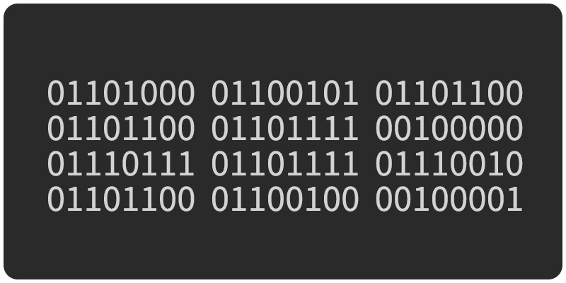

# Learn Computing

Basic, intermediate, and advanced computing lesson modules

## Instructions

1. Select an activity (that is new to you, from the top) and find your group.
1. Follow the instructions in the activity.
1. Make notes while you engage with the material, in order to [teach](https://en.wikipedia.org/wiki/Jigsaw_(teaching_technique)) the concepts to the rest of the class.
1. After you finish, prepare to share what you have learned.
1. Each module takes about 25–30 minutes, and you will have 3–5 minutes to present.

## Section 1

Essential knowledge for working with computers.

<table>
<tr>

<td>
<a href="topics-command-line.md">

Command line, shell, bash</a>
</td>

<td>
<a href="topics-files-folders.md">

Users, permissions, the filesystem</a>
</td>

</tr>
</table>
<table>
<tr>

<td>
<a href="topics-keyboard-shortcuts.md">

Keyboard shortcuts, Workflows</a>
</td>

<td>
<a href="https://docs.google.com/presentation/d/1vtK6LoqwF4rQQZZy-ovuEgsYUwwMRXsqDVMOjAPSBt0/edit#slide=id.p">

Version Control</a>
</td>

</tr>
</table>

## Section 2

Working with media, data, and setting up a development environment.

<table>
<tr>

<td>
<a href="topics-web-development.md">

Web Development Environment</a>
</td>

<td>
<a href="topics-networks.md">

Networks</a>
</td>

</tr>
</table>
<table>
<tr>

<td>
<a href="topics-images.md">

Images and video</a>
</td>

<td>
<a href="topics-data-basics.md">

Introduction to data</a>
</td>

</tr>
</table>

## Section 3

<table>
<tr>

<td>
<a href="topics-data-cleaning.md">

Data cleaning</a>
</td>

<!-- <td>
<a href="topics-computational-thinking.md">

Computational thinking</a>
</td>
 -->

</tr>
</table>

📌 = in-progress

## License

This work is licensed under <a href="http://creativecommons.org/licenses/by-nc/4.0/?ref=chooser-v1" target="_blank" rel="license noopener noreferrer">Attribution-NonCommercial 4.0 International

  </a>

