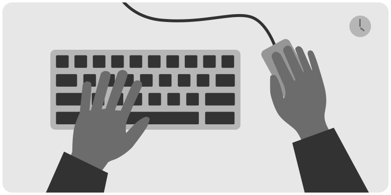
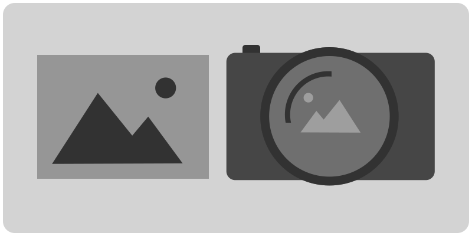
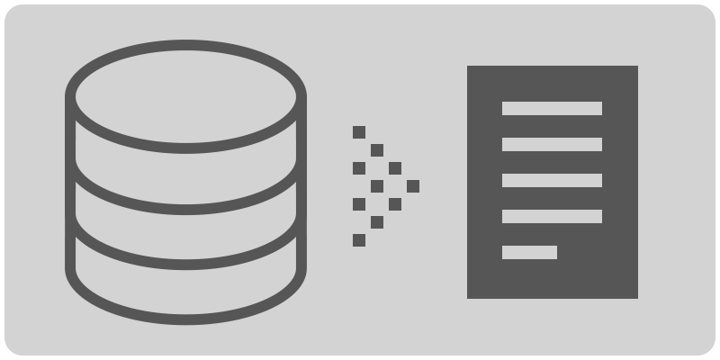
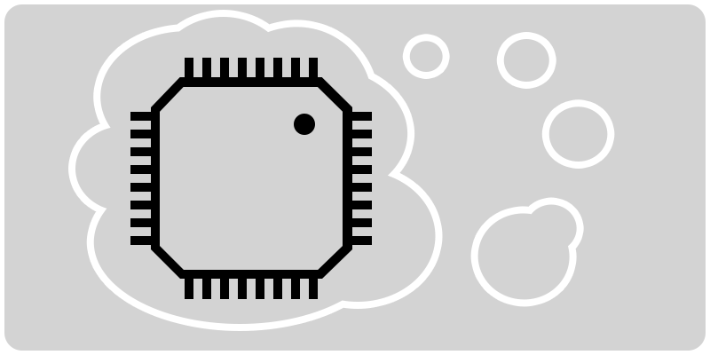
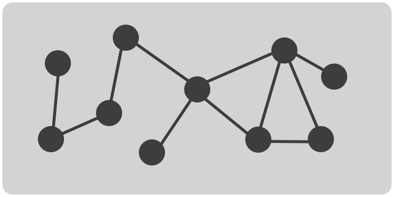

# Learn Computing

Basic, intermediate, and advanced computing lesson plans.

## Process

1. Select an activity (new to you) and find your group.
1. Follow the instructions in the activity, thinking about how you will teach it to the rest of the class.
1. After you finish, prepare to share what you have learned.
1. Each module takes about 30 minutes, and you will have 3 minutes to present.

## Section 1

Essential knowledge for working with computers.

<table>
<tr>

<td>
<a href="topics-keyboard-shortcuts.md">

Keyboard shortcuts, Workflows</a> 🍏
</td>

<td>
<a href="topics-files-folders.md">

Users, permissions, the filesystem</a>
</td>

</tr>
</table>
<table>
<tr>

<td>
<a href="topics-command-line.md">

Command line, shell, bash</a> 🍏
</td>

<td>
<a href="topics-files-folders.md">

Naming conventions</a>
</td>

</tr>
</table>

## Section 2

Working with media, data, and setting up a development environment.

<table>
<tr>

<td>
<a href="topics-images.md">

Images and video</a>
</td>

<td>
<a href="topics-data.md">

What is data?</a>
</td>

<td>
<a href="topics-web-development.md">

Web Development</a>
</td>

<td>
<a href="topics-version-control.md">

Version Control</a>
</td>

</tr>
</table>

## Section 3

<table>

<tr>
<td>
<a href="topics-computational-thinking.md">

Computational thinking</a>
</td>

<td>
<a href="topics-networks.md">

Networks</a>
</td>

</tr>

</table>

🍏 = complete

## License

This work is licensed under <a href="http://creativecommons.org/licenses/by-nc/4.0/?ref=chooser-v1" target="_blank" rel="license noopener noreferrer">Attribution-NonCommercial 4.0 International

  </a>

