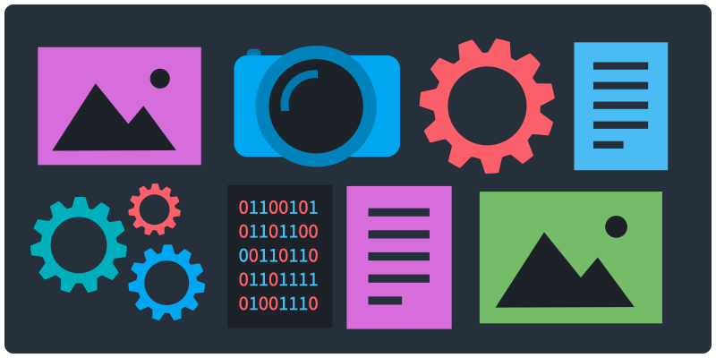
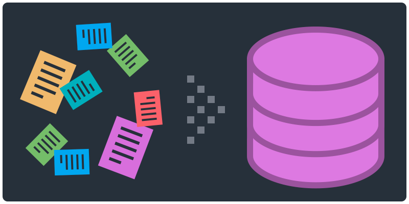
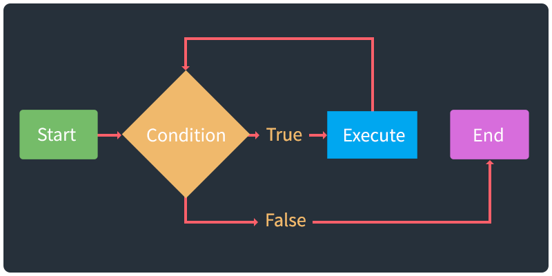

# Learn Computing

Active Learning Modules for Computer Literacy

## Instructions

1. Select an activity (that is new to you, from the top) and find your group.
1. Follow the instructions in the activity.
1. Make notes while you engage with the material, in order to [teach](https://en.wikipedia.org/wiki/Jigsaw_(teaching_technique)) the concepts to the rest of the class.
1. After you finish, prepare to share what you have learned.
1. Each module takes about 25–30 minutes, and you will have 3–5 minutes to present.

## Basics

Essential knowledge for working with computers.

<table>
<tr>

<td width="50%">

The Command line - <a href="slides/command-line.html">slides</a> | <a href="topics/command-line.md">md</a>
</td>

<td width="50%">

The Filesystem - <a href="slides/files-folders.html">slides</a> | <a href="topics/files-folders.md">md</a>
<!-- Users, files, folders -->
</td>

</tr>
</table>
<table>
<tr>

<td width="50%">

Keyboard shortcuts, Workflows - <a href="slides/keyboard-shortcuts.html">slides</a> | <a href="topics/keyboard-shortcuts.md">md</a>
</td>

<td width="50%">

Git Version Control</a>📌 - <a href="https://docs.google.com/presentation/d/1vtK6LoqwF4rQQZZy-ovuEgsYUwwMRXsqDVMOjAPSBt0/edit#slide=id.p">slides</a>
</td>

</tr>
</table>
<table>
<tr>

<td width="50%">

Files and naming conventions - <a href="slides/files-naming-conventions.html">slides</a> | <a href="topics/files-naming-conventions.md">md</a>
</td>

<td width="50%">
</td>

</tr>
</table>

## Internet

Understanding networks and setting up a development environment.

<table>
<tr>

<td width="50%">

Web Development Environment - <a href="slides/web-development.html">slides</a> | <a href="topics/web-development.md">md</a>
</td>

<td width="50%">

Networks - <a href="slides/networks.html">slides</a> | <a href="topics/networks.md">md</a>
</td>

</tr>
</table>

<table>
<tr>

<td width="50%">

Web servers📌  - <a href="slides/web-servers.html">slides</a> | <a href="topics/web-servers.md">md</a>
</td>

<td width="50%">

Debugging📌  - <a href="slides/debugging.html">slides</a> | <a href="topics/debugging.md">md</a>
</td>

</tr>
</table>

## Media

Working with images, video, and color.

<table>
<tr>

<td width="50%">

Images and video 📌 
<!-- - <a href="slides/images-resolutions.html">slides</a> | <a href="topics/images-resolutions.md">md</a> -->
</td>

<td width="50%">

Color 📌 
<!-- - <a href="slides/color.html">slides</a> | <a href="topics/color.md">md</a> -->
</td>

</tr>
</table>

<table>
<tr>

<td width="50%">

Documenting digital works - <a href="slides/documentation.html">slides</a> | <a href="topics/documentation.md">md</a>
</td>

<td width="50%">

Displays and monitors📌 - <a href="slides/displays.html">slides</a> | <a href="topics/displays.md">md</a>
</td>

</tr>
</table>

## Data

Working with data and APIs.

<table>
<tr>

<td width="50%">

Data Basics - <a href="slides/data-basics.html">slides</a> | <a href="topics/data-basics.md">md</a>
</td>

<td width="50%">

Data types - <a href="slides/data-types.html">slides</a> | <a href="topics/data-types.md">md</a>
</td>

</tr>
</table>
<table>
<tr>

<td width="50%">

Data cleaning - <a href="slides/data-cleaning.html">slides</a> | <a href="topics/data-cleaning.md">md</a>
</td>

<td width="50%">

How to use APIs - <a href="slides/data-apis.html">slides</a> | <a href="topics/data-apis.md">md</a>
</td>

</tr>
</table>
<table>
<tr>

<td width="50%">
</td>

 <td width="50%">
<!--
Computational thinking📌  - <a href="slides/computational-thinking.html">slides</a> | <a href="topics/computational-thinking.md">md</a>
-->
</td>

</tr>
</table>

<!--

TO Add

- Design Thinking from 404 and 245
https://www.google.com/search?q=design+thinking&safe=off&rlz=1C5CHFA_enUS903US909&sxsrf=ALeKk00UmuqK1Wv7fRyv0LQz13FoXSjw9g:1600281343883&source=lnms&tbm=isch&sa=X&ved=2ahUKEwjwrqvIqO7rAhWKMd8KHcCsCwMQ_AUoAXoECB0QAw&biw=1440&bih=798

- Design Patterns from 245 - might need to go in 245 repo

-->

📌 = in-progress

## Credit

Owen Mundy [Learn Computing: Active Learning Modules for Computer Literacy](https://github.com/omundy/learn-computing) 2021.

## License

This work is licensed under <a href="http://creativecommons.org/licenses/by-nc/4.0/?ref=chooser-v1" target="_blank" rel="license noopener noreferrer">Attribution-NonCommercial 4.0 International

  </a>

