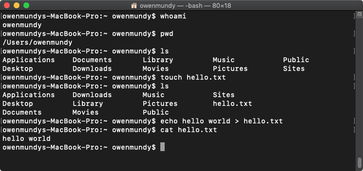
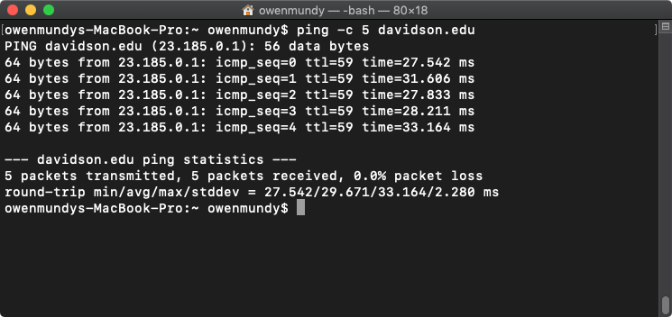
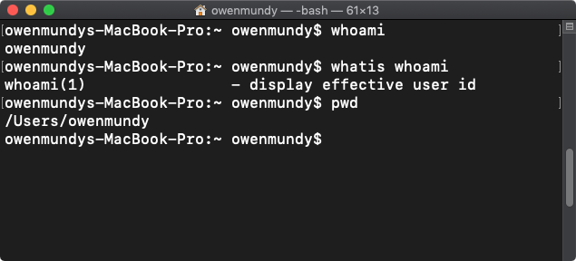
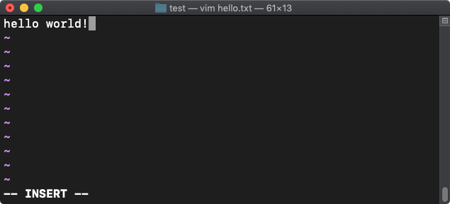
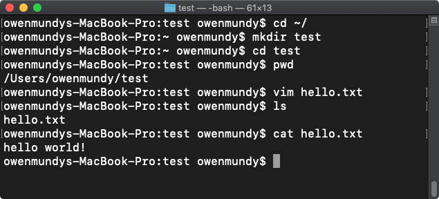

[<](README.md)


# Command Line, Terminal, Bash

No matter what you call it, using the command line is essential to computing proficiency.

### Contents

1. [Learning objectives](#learning-objectives)
1. [Crash Course](#crash-course) <small>`5 min`</small>
1. [Introduction](#introduction) <small>`5 min`</small>
1. [Navigating the filesystem](#navigating-the-filesystem) <small>`5 min`</small>
1. [Creating and editing files](#creating-and-editing-files) <small>`5 min`</small>
1. [Running programs](#running-programs) <small>`5 min`</small>
1. [Discussion](#discussion) <small>`5 min`</small>
1. [Keep practicing](#keep-practicing)
1. [Assessment](#assessment)
1. [References](#references)

### Learning objectives

Students who complete the following will be able to:

- Explain what the command line is and what it can do
- Open a command line program on their computer and execute basic commands
- Navigate and create files on their computer using the command line
- Edit and run a Python script using the command line


## Crash course

The command line allows you to control your computer via a text interface. Following is a quick introduction:

1. [Open the Terminal application](topics-basics.md#find-a-file-or-program).
1. Note the **prompt** after the `$` `%` or `#` symbol. This is where you will type commands.
1. Type each of the following commands at the prompt, pressing return each time.
1. If you make a mistake press backspace or `Control + C` to cancel.


Step | Command | Description
---: | --- | ---
1 | `whoami` | Display [the username of current user](https://en.wikipedia.org/wiki/Whoami)
2 | `pwd` | Display the full path of your current folder, or [working directory](https://en.wikipedia.org/wiki/Pwd)
3 | `ls` | [List the files](https://en.wikipedia.org/wiki/Ls) in your current directory
4 | `touch hello.txt` | [Create a new file](https://en.wikipedia.org/wiki/Touch_(command)) called hello.txt
5 | `ls` | List files to confirm the new file was created
6 | `echo "hello world" > hello.txt` | Write some text in the new file
7 | `cat hello.txt` | View contents of new file (as in "con[cat](https://en.wikipedia.org/wiki/Cat_(Unix)enate"))
8 | `ping -c 5 davidson.edu` | A [networking utility](https://en.wikipedia.org/wiki/Ping_(networking_utility)) to check the connection to any website.

Congratulations! 🎉 You've completed some basic commands on a CLI.

<a href="assets/img/command-line-crash-course.png"></a> <a href="assets/img/command-line-ping.png"></a>
<sub>Click to view example output from the steps.</sub>


## Introduction

Review the following sections and perform the activities with your group.


### About the command line

The command line is a text interface for your computer. You type commands, and the computer operating system (OS) will run them when you press enter. From the command line, you can navigate through files and folders on your computer, just as you would with Windows Explorer or Finder on Mac OS. The difference is that the command line is fully text-based and offers additional options that your GUI (Graphical User Interface) might not.


### Terms

- OS => Operating System
- CLI => [Command Line Interface](https://en.wikipedia.org/wiki/Command-line_interface)
- Shell => The application where you use the command line
- Bash ("Bourne Again Shell") => A type of shell
- Shell programming => [Programming and running scripts](https://www.tutorialspoint.com/unix/shell_scripting.htm) (e.g. `.sh`) using a shell


### Installation

- Mac - The Terminal application is already installed
- Windows - Install [Git Bash](https://gitforwindows.org/) or use [Windows Terminal](https://www.microsoft.com/en-us/p/windows-terminal/9n0dx20hk701)
- Linux - [LXTerminal](https://www.raspberrypi.org/documentation/usage/terminal/) is already installed


### Running commands

When you [open your command line application](topics-basics.md#find-a-file-or-program), you'll be greeted by the command prompt, signified by the `$`. This is where you type commands and press enter to make the shell read your input and determine which command to execute.



For example, run the `whoami` command to "output" or "return" your username:

```bash
whoami
# -> <username>
```

The shell looks at the first word to determine the command to run, then uses the following words as needed for parameters.

```bash
whatis whoami
# -> - display effective user id
man whoami
# -> <displays the manual entry for whoami command> -> press "q" to exit
```
Note, the hash symbol `#` is used as a comment in bash scripting, so therefore skipped by the shell when evaluating the input. These are displayed here only as a reference.

Finally, you can combine commands in new ways with special characters. The double ampersand `&&` let's you combine more than one command:

```bash
whoami && pwd && echo Hello world!
# -> <outputs all three in series>
```


## Navigating the filesystem

Let's learn how to move around. Most commands are shortened or abbreviations for the English equivalent of what they perform. Run these commands and try to guess what they do.

```bash
pwd
ls
ls -la
```

If you guessed "print working directory" and "list" you were correct!

The `ls` command lists the contents of the directory that you are currently in (your present "working directory"). The `-la` component of the `ls` command are known as 'flags', which modify the command you run. In this case the `l` displays the contents of the directory in a list, showing file sizes and last edit date. The `a` displays all files, including those beginning with a `.`, which are hidden configuration files for software.

Let's "change to a new directory" now with the following and output the files. Do you know where you are?

```bash
cd /
ls -la
```

Using `cd /` changes our current working directory to the [root of the computer](topics-files-folders.md#users-and-permissions), where you'll mainly find a lot program files. You can return to your home directory (usually where you start when you open a new shell) with the following (a tilda `~` + `/`):

```bash
cd ~/
```


## Creating and editing files

Let's make a new folder in our home directory to create some test files. Before you do the following, make sure you have a Finder or Explorer window open so you can see the effects of your work in the GUI.

```bash
cd ~/ # confirm you are home
mkdir test # make a new directory called "test"
cd test # change to the directory
pwd # confirm you are in <username>/test
```

Great! Now let's create a new file and edit it. This command will create a new file named "hello.txt":

```bash
touch hello.txt
```

On Windows, if you use Git Bash the default editor will be [Vim](https://www.radford.edu/~mhtay/CPSC120/VIM_Editor_Commands.htm). On Mac you can also use [Nano](https://linuxize.com/post/how-to-use-nano-text-editor/). The following will open (or if it doesn't yet exist, create and open) a file called hello.txt in the Vim text editor:

```bash
vim hello.txt
```

Vim has two modes: *command* and *insert*. In the command mode, you can move around the file, delete text, save, etc. In the insert mode, you can insert text.

To change to the insert mode, press `i`. Type some text.



Change back to command mode by pressing `ESC`. Now you can save your file by pressing `:wq` (write and quit). Once you do this, run the following to confirm the file exists and its contents.

```bash
ls hello.txt
cat hello.txt
# -> hello world!
```




## Running programs

Excellent! Now, in our final section, we'll create and run a Python script with Vim.

```bash
pwd # confirm you are still in <username>/test
clear # "clears" the terminal (you can still scroll up to see previous commands)
vim hello.py # create a plain text file with the .py extension
```

In the Vim editor, press `i` to enter insert mode, and paste or type the following code in the file:

```python
string1 = "I"
string2 = " <3"
string3 = " the CLI"
joined_string = string1 + string2 + string3
print(joined_string)
```

Press `ESC` and then `:wq` to save and quit the editor. Run your file with:

```bash
python script.py
```

Congratulations! 🎉 &nbsp; Similar to using built-in commands, you've created a file that runs its own script!


## Discussion

Discuss the following with your group and share a short demo on the above with the class.

1. Demonstrate example commands that show
	- how to navigate the filesystem
	- how to create files
	- how to run a program
1. Which items can you connect to concepts you already know about computers? e.g. 🏠 📂 👤 🧠 🐍
1. Revisit the learning objectives for this section. Did you accomplish the goals in this lesson? What questions do you have?


## Keep practicing

Additional commands and prompts to continue learning the command line:

- Change the text your python file prints and run the script again. **Tip**: Use the up `↑` and down `↓` arrows on the keyboard to cycle through previous commands.
- Try out the autocomplete feature of the shell by typing the first three letters of a filename and pressing `tab`. If a file or directory that starts with that name exists the shell will fill it in for you.
- [16 Terminal commands every user should know](https://www.techrepublic.com/article/16-terminal-commands-every-user-should-know/)


## Assessment

Ready to test your skills? See if you can

1. Complete the [command line lesson on Codecademy](https://www.codecademy.com/learn/learn-the-command-line).
1. [Write a simple bash script](https://www.linux.com/training-tutorials/writing-simple-bash-script/)


## References

- Ubuntu [The Linux command line for beginners](https://ubuntu.com/tutorials/command-line-for-beginners#3-opening-a-terminal)
- Codecademy [List of Command Line Commands](https://www.codecademy.com/articles/command-line-commands)
- Raspberry Pi [Terminal](https://www.raspberrypi.org/documentation/usage/terminal/)
