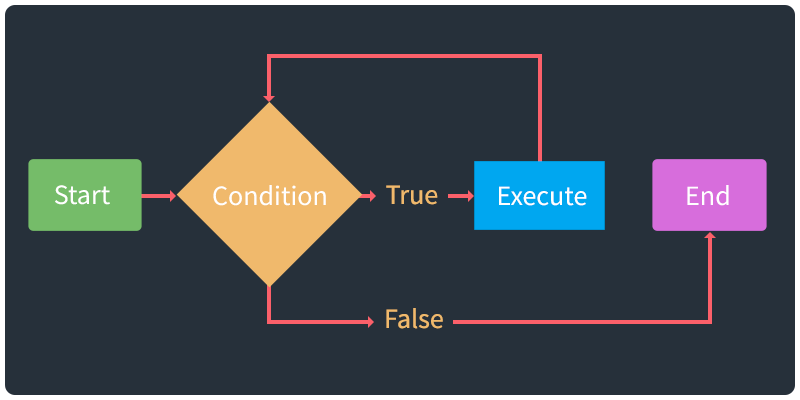

[<](README.md)

# Computational Thinking

Logic, data flow, etc.

### Contents

1. [Introduction](#introduction) `5 min`
1. [Discussion](#discussion) `5 min`
1. [Keep practicing](#keep-practicing)
1. [References](#references)

## Introduction

Review the following sections and perform the activities on your own or with your group.

Learning Objectives

Students who complete the following will be able to:

- Describe ...
- List ...
- Explain ...
- Demonstrate ...

Preparation

Complete the following to prepare for this module

- [Command Line Crash Course](topics-command-line-crash-course.md)

### Coming soon

- https://csunplugged.org/en/topics/sorting-networks/
- https://edu.google.com/resources/programs/exploring-computational-thinking/
- https://www.digitaltechnologieshub.edu.au/search#/site-search?pageNumber=1&keyword=GoogleCT
- https://www.gettingsmart.com/2018/03/early-learning-strategies-for-developing-computational-thinking-skills/
- https://www.google.com/search?q=computational-thinking&safe=off&rlz=1C5CHFA_enUS903US909&sxsrf=ALeKk02K0Ksznja200f7HCS29B35WmiJ_g:1619879844197&source=lnms&tbm=isch&sa=X&ved=2ahUKEwiwmsTV2qjwAhXDKs0KHdJFC7sQ_AUoAXoECAEQAw&biw=1920&bih=1066#imgrc=nXOw92GlPSFwAM

### Notes

- State, state control, build state machine
- Iteration, structure, flow chart to describe
- logic / flow structure, flow chart to describe
- algorithms - create your own to represent some thing that exists in the world.

## Discussion

In your group, discuss the following.

- Q1
- Q2
- Q3

## Keep practicing

## References
