[<](README.md)


# Data Cleaning

Tips for cleaning data

### Contents

1. [Introduction](#introduction)
1. [About Data Cleaning](#about-data-cleaning) `5 min`
1. [Remove formatting](#remove-formatting) `5 min`
1. [Preserve tabular data](#preserve-tabular-data) `5 min`
1. [Type conversion](#type-conversion) `5 min`
1. [Find and replace with RegEx](#find-and-replace-with-regex) `5 min`
1. [Discussion](#discussion) `5 min`
1. [Keep practicing](#keep-practicing)
1. [References](#references)


## Introduction

Review the following sections and perform the activities on your own or with your group.

<details>
<summary>Learning Objectives</summary>

Students who complete the following will be able to:

- Describe data cleaning and its benefits
- Compare data before and after cleaning
- List methods for data cleaning
- Improve and clean data for visualization or other use

</details>

<details>
<summary>Preparation</summary>

Complete the following to prepare for this module

- [Command Line Crash Course](topics-command-line-crash-course.md)
- [Learn Computing: Data Basics](topics-data-basics.md)

</details>


## About Data Cleaning

Data cleaning is a process that involves

1. Identifying unfinished, unreliable, inaccurate, or non-relevant parts in a dataset, table, or database
1. Removing or correcting the dirty or inaccurate data

Data cleaning can be performed as via scripting or interactively with data cleaning tools.


## Remove whitespace

[Whitespace characters](https://en.wikipedia.org/wiki/Whitespace_character) (tabs, spaces, line breaks) are essential to make text documents human-readable, but if you have too many they can really clutter up a dataset.

```bash
      this  is                      some
			 really       dirty
	 data       !
```

Replacing all the spaces, tabs, and line breaks ("carriage returns") in the example above by hand would be a lot of work in a big dataset. However, you can use simple find/replace tools in Atom to make short work of this.

👉 **Try it out**

1. Copy the text in the example above into Atom
1. Try to remove the three types of whitespace from the text using **only** the find / replace tools.

<details>
<summary>Hint</summary>

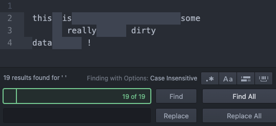

- Whitespace is invisible, but you can still copy / paste the characters into find / replace.
- To replace all the extra spaces, search for two spaces and replace with a single space.

</details>


## Remove formatting

When getting data for a project, the goal is almost always to be able to reuse the data somehow. Usually this means pasting into a plain text document (e.g. `csv` or `json`), spreadsheet, or database.

Perhaps the simplest way to get data is to copy and paste. If you copy any [formatted](https://www.nytimes.com/2021/08/31/technology/facebook-accenture-content-moderation.html) (a.k.a. "rich") text from the web or a document, then that formatting will be applied if you paste it into a document that supports the formatting.

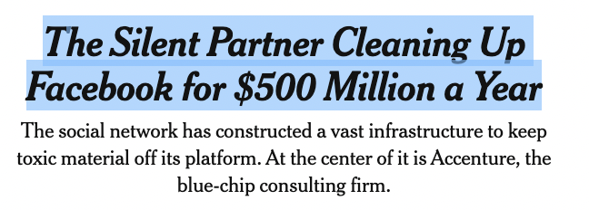 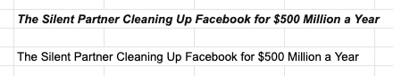

👉 **Try it out**

To remove rich text formatting from copied text either (above, the 2nd example on right)

 - Immediately paste the text into a plain text document, then select all and copy the unformatted text.
 - Use a supported like (Google Docs): Edit > Paste without formatting, or (Google Sheets) Edit > Paste special > Paste values only


## Preserve tabular data

Many times you will want to paste tabular data into a spreadsheet to be able to sort or further change the data using the columns. While you can paste *tab-separated* data and preserve the columns and rows, *comma-separated* data will not automatically be recognized as tabular. Two options to correct this issue:

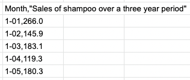

### Save as CSV

If the text is comma-separated...

1. Copy / paste the text into a new plain text file.
1. Save the file as a `.CSV`
1. Open the in Excel or Google Sheets.

### Find and Replace with a tab character

1. Copy / paste the text into a new plain text file in [Atom](https://atom.io/).
2. Use Find to search for the delimiter

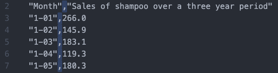

3. Type a tab character and copy and paste it into the replace field.

Copy and paste a tab character into the replace field.

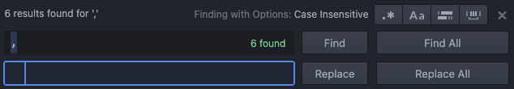

5. Click Replace All

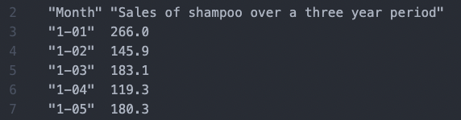

5. Copy / paste the now *tab-delimited* data into your spreadsheet, which will recognize that we are pasting tab-separated content and add each field to its own column.

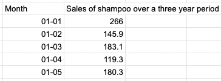


👉 **Try it out** - Try to paste some tabular data from

- [this page](https://machinelearningmastery.com/time-series-datasets-for-machine-learning/) into a sheet and preserve the column structure.
- [these advertising categories](https://developers.google.com/adwords/api/docs/appendix/verticals) so that all the tiers are represented in their own columns.


## Type conversion

Once you import your data into a spreadsheet it will likely be treated as plain text. In order to sort, present, or chart the data you may need to use the spreadsheet application to recognize the data type.

For example, once a column is set as a date format you can select how you wish that date to be displayed:

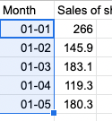 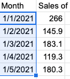


## Find and replace with RegEx

Sometimes you may need to use something more powerful to clean your data. This example uses Regular Expressions to search for specific instances of text.

👉 **Try it out**

Take [these stock symbols](datasets/nasdaqtraded-20210831.txt)

1. Select all, copy, and paste them into a new document in Atom.
1. Searching for all the pipes `|` shows some of what we do and don't want.
1. Enabled Regular Expressions and Case Sensitive in Atom
1. Search for each of the following
 	1. `[A-Z]` - Any capitalized letters
	1. `[A-Z]{1,5}` - Any capitalized letters, one to five characters long
 	1. `^[A-Z]{1,5}` - Any capitalized letters, one to five characters long, at the start of a string
 	1. `(^[A-Z]{1,5})` - Wrap this match in a capture group
	1. `(^[A-Z]{1,5})+(.*)` - Add a second group that matches any number of any character
1. Add to the replace `$1` to copy the result of the first capture group
1. And Find All / Replace All

We could make these stock symbols into a Javascript array using

1. Find `(^[A-Z]{1,5})` and Replace: `'$1',`
1. Adding `const arr = [` to the beginning and `];` to the end


## More Regex examples

Find `"(.*)-(.*)",` and replace `$1, $2,`

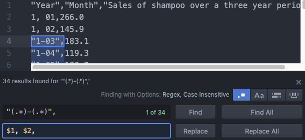


## Keep practicing

- [Learn Computing: Data Types](topics-data-types.md)


## References

- Towards Data Science [The Ultimate Guide to Data Cleaning](https://towardsdatascience.com/the-ultimate-guide-to-data-cleaning-3969843991d4)
- Tableau [Guide To Data Cleaning: Definition, Benefits, Components, And How To Clean Your Data](https://www.tableau.com/learn/articles/what-is-data-cleaning)
