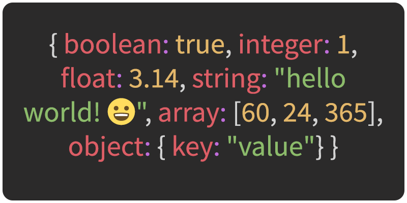

[<](README.md)

# Data Basics

Learn about specific data types used in programming, visualization, gaming, etc.

### Contents

1. [Introduction](#introduction)

1. [Common Data Types](#common-data-types) `5 min`
1. [Data Collections](#data-collections) `5 min`

1. [Discussion](#discussion) `5 min`
1. [Keep practicing](#keep-practicing)
1. [References](#references)

## Introduction

Review the following sections and perform the activities on your own or with your group.

Learning Objectives

Students who complete the following will be able to:

- Recall
- Organize
- List common data types and recall examples of each
- Explain what a collection is and provide examples
- Use appropriate formats to create data representations of real world examples

Preparation

Complete the following to prepare for this module

- [Command Line Crash Course](topics-command-line-crash-course.md)
- [Learn Computing: Data Basics](topics-data-basics.md)

## Common Data Types

Thus, a boolean type requires less memory to store than a string type. The string `"false"` contains 5 characters and thus requires 5 bytes. Zero

A data type defines the kind of data that is stored. This is important for many reasons:

Here are some common types and examples of each:

- Booleans (`true` and `false`)
- Numbers (integers and floats)
- Strings
- Collections

Note: A type is different than it's value. `true` is the value of the type `Boolean`.

## Discussion

Discuss the following:

1. Give an example of each of the types above
2. What type is this? `"3.14"`

## Data Collections

- Explain what a collection (data points, arrays, objects) is and give examples

- Arrays
- Objects
- Serialized vs. Unserialized data

e.g. A time series is a collection of observations made sequentially in time.

## Hierarchical Types

- json, xml, etc.

## Discussion

- Use appropriate data formats to create representations of objects, things, in the world
- CSV, JSON, etc.

## Keep practicing

- [Learn Computing: Data Cleaning](topics-data-cleaning.md)

## References

- [When bandwidth and storage size matters: Bits vs. bytes](https://www.redhat.com/sysadmin/bits-vs-bytes)
- [What Every Programmer Absolutely, Positively Needs To Know About Encodings And Character Sets To Work With Text](https://kunststube.net/encoding/)
- [Zoom into a computer chip: Watch this video to fully appreciate just how magical modern microchips are](https://www.extremetech.com/extreme/191996-zoom-into-a-computer-chip-watch-this-video-to-fully-appreciate-just-how-magical-modern-microchips-are)
