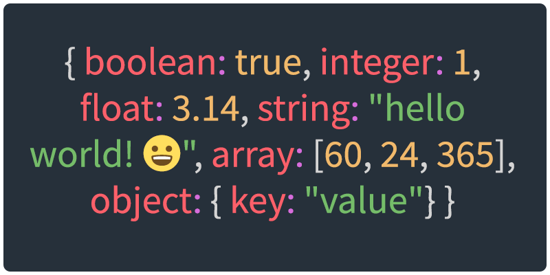

[<](README.md)



# Data Types

Learn about specific data types used in programming, visualization, gaming, etc.

### Contents

1. [Introduction](#introduction)
1. [About data types](#common-data-types) `5 min`
1. [Primitive data types](#common-data-types) `5 min`
1. [Explore data types in the console](#explore-data-types-in-the-console) `5 min`
1. [Type conversion](#type-conversion) `5 min`
1. [Data collections](#data-collections) `5 min`
1. [Data exchange formats](#data-exchange-formats) `5 min`
1. [Advanced topics](#advanced-topics) `5 min`
1. [Keep practicing](#keep-practicing)
1. [References](#references)


## Introduction

Review the following sections and perform the activities on your own or with your group.

<details>
<summary>Learning Objectives</summary>

Students who complete the following will be able to:

- Define and compare data types, as well as strongly- and loosely-typed programming languages
- List common data types and recall examples of each
- Explain what a data collection is and provide examples
- Use appropriate types to create data representations of real world examples

</details>

<details>
<summary>Preparation</summary>

Complete the following to prepare for this module

- [Command Line Crash Course](topics-command-line-crash-course.md)
- [Learn Computing: Data Basics](topics-data-basics.md)

</details>


## About data types

A **data type** defines the *kind* of data that is stored or used by a program.

Most languages organize data by **primitive** and **non-primitive** types. These diagrams show the most common data types in Javascript and C# languages.


> The **primitive** and **non-primitive** organization structure (a.k.a. **value** vs. **reference**) also explains how data is stored in computer memory and affects software production and performance. See [Advanced Topics](#value-vs-reference-types) for more.


A data type is different than its **value**. In this C# example below, `7` is the *value* of the `mid` variable  and `int` (integer) is its *type*.

```cs
// Unity C# example
public class Monster
{
    int mid = 7;
    float health = 0.20f;
}
```

Some programming languages (e.g. C#, Java, Python) are [strongly typed](https://en.wikipedia.org/wiki/Strong_and_weak_typing), requiring programmers to predefine what kind of data they are using in variables, parameters, functions, etc. before they actually use them.

Other, **loosely typed** languages like Javascript, Perl, and PHP, *do not* require programmers to define their type ahead of time.

```js
// javascript example
var mid = 7;
var health = 0.20;
```


## Primitive data types

These common primitive data types (and examples) can be found across many strong- and loosely-typed programming languages and databases.

> 👉 Presenter Note: Demonstrate these with `typeof` in the DevTools Console.


### Boolean

The boolean type can only have one of two values:

```js
true
false
```

Most programming languages have a default value for a type. When you create a new boolean variable in a strongly-typed language it will be `false` by default.


### Integer

Integers (a.k.a. `int` types) are used to store whole numbers.

```js
-4
1
45
10000000000
```

### Floats

Numbers with decimals, also called `floats` ("floating-point numbers").

```js
3.14
.0000001
10000000000.0
```

Unlike many other languages, Javascript does not distinguish between `int` and `float` number types.


### Strings:

A string is any grouping of letters, words, numbers, or character symbols surrounded by single or double quotes, or back ticks.

```js
"hello world 😀"
'2 be or not 2 be'
`favorite numbers: 1, 2, and 3.14`
```


### Non-types

Just as there are types that represent data, there are types that represent NO data

- **Null** is a zero value. A special “value” that represents NO value!
- **undefined** is the value of a variable that has not been assigned a value.

```javascript
var myVar;
myVar // -> undefined
```


<!-- Variations of this section:
learn-javascript/javascript-1/1-0-introduction.md
learn-computing/topics-data-types.md
-->

## Explore data types in the console

An [expression](https://developer.mozilla.org/en-US/docs/Web/JavaScript/Guide/Expressions_and_Operators) is any unit of code that resolves to a data value. Expressions are the fundamental building blocks of code, and use data ("operands") with [operators](https://www.w3schools.com/js/js_operators.asp) to perform math, logic, or string calculations.

### 👉 **Try it out**

1. In a web browser, [open the Developer Tools](https://developer.chrome.com/docs/devtools/open/) and click Console.
2. At the bottom, you will see a `>` **prompt** where you can enter (*input*) Javascript code.
3. **Primary expressions** - If you pass data to Javascript it will simply **return** the data's value.

```js
12
```

<details>
<summary>Solution</summary>


</details>


4. Adding an [arithmetic](https://developer.mozilla.org/en-US/docs/Web/JavaScript/Guide/Expressions_and_Operators#arithmetic_operators) operator and another data value will prompt Javascript to **evaluate** the code, multiplying the values to **return** (*output*) the *new* value `144` produced.

```js
12 * 12
```

5. If you use the [`typeof`](https://developer.mozilla.org/en-US/docs/Web/JavaScript/Reference/Operators/typeof) operator, Javascript will return a string describing the data's *type*.

```js
typeof 12
```

6. If you combine expressions, Javascript will evaluate each in the appropriate order. **What will these return?**

```js
typeof (12 * 12)
typeof (typeof (12 * 12))
typeof "hello world!"
```

<details>
<summary>Solution</summary>

```js
typeof (12 * 12) // -> "number"
typeof (typeof (12 * 12)) // -> "string" - The 1st returns "number", a string value, to the 2nd
typeof "hello world!" // -> "string"
```
</details>


7. A data's value and its type are not the same thing. **What type are these?**

```js
555
"555"
`false`
true
```

<details>
<summary>Solution</summary>

```js
555 // -> "number"
"555" // -> "string"
`false` // -> "string"
true // -> "boolean"
```
</details>


## Type conversion

Many programming languages allow you to [convert a data's type](https://en.wikipedia.org/wiki/Type_conversion). In Javascript, [type conversion](https://developer.mozilla.org/en-US/docs/Glossary/Type_Conversion) can happen intentionally (a.k.a. "explicit conversion"), such as when you use built-in functions to initiate the conversion.

```js
typeof Number("555") // -> "number"
typeof String(555) // -> "string"
```

It can also happen when it automatically converts your data to another type (a.k.a. "implicit conversion" or "type [*coercion*](https://developer.mozilla.org/en-US/docs/Glossary/Type_coercion)"). For example, when you use the `+` operator with two numbers then Javascript will perform arithmetic. But, if one of the operands is a `string` it will automatically convert all data types to `string` and then concatenate them into a larger string.  

```js
var test = 10;
test + 1 // -> 11
test + " apples" // -> "10 apples"
```


## Data collections

The terms, "data collection" and "data set", are sometimes used interchangeably. While a data collection can be used to describe the formal data type categories in programming languages, or the ways that one or more data values are organized together, both terms might be used to refer to any type of data exchange format (discussed in the next section).

Regardless, data collections contain more than one value, allowing for comparisons of multiple points. For example, a time series dataset, is a collection of observations made sequentially in time.

In terms of programming language data types, Javascript (refer to the table above) and other languages use "data collection" to mean a collection of single data values.


### Arrays

Most languages use the `array` type to store one or more instances of the same type (or even different types) of data. The instances are separated by commas, enclosed in square brackets. In Javascript, these are both valid arrays:

```js
var numbers = [4,3,2,1];
var greeting = ["hello", "world"];
```

In Javascript, you can assign or retrieve individual cells from arrays like below. Arrays are zero-indexed so providing `1` between the square brackets gives you the 2nd value:

```js
greeting[1] // -> "world"
```

The `array` data type is a common way to store tabular data (rows and columns). To do this, we use an array of arrays, or "two-dimensional array", where each row is its own array:

```js
var cars = [
    ["make", "model", "year"],
    ["Pontiac", "Vibe", 2009],
    ["Honda", "Fit", 2007],
    ["Chevrolet", "Blazer", 2000],
    ["Toyota", "RAV4", 1999]
];
```
To get a "cell" in this table, use the following notation, where the first number is the row, and second is the column:

```js
cars[1][0] // -> "Pontiac"
```


### 👉 **Try it out**

1. Copy / paste the cars array into the console and press return. The data is now saved there.
1. You can log the above example using `console.log()` by placing the reference to the data point inside the parentheses, like this: `console.log(cars[1][0])`
1. Log the notation to access the Chevrolet's model only.
1. Log the notation to access the Honda's year.
1. Log the notation to access the make of the car built in 1999.

<details>
<summary>Solution</summary>

```js
console.log(cars[3][1]); // -> "Blazer"
console.log(cars[2][2]); // -> 2007
console.log(cars[4][0]); // -> "Toyota"
```
</details>


### Objects

Javascript contains its own definition of objects, which is slightly different than the way that other languages use objects and classes.

```js
var person = {
    "firstName": "John",
    "lastName": "Doe",
    "age": 25
};
```

Javascript objects are powerful types because you can store any type of data in them, even arrays, other objects, and functions.

```js
var singer = {
    "name": "Bruce Springsteen",
    "albums": [
        {
            "name": "Born to Run",
            "year": 1975
        }, {
            "name": "Born in the U.S.A.",
            "year": 1984
        }, {
            "name": "The Ghost of Tom Joad",
            "year": 1995
        }
    ]
};
```

With Javascript, each data `value` is assigned to a `key`, and you access the value using using dot notation. So above, we can access the singer's name using:

```js
singer.name; // -> "Bruce Springsteen"
```


### 👉 **Try it out**

1. Copy / paste the singer object into the console and press return. The data is now saved there.
1. Log the singer's name.
1. Log the name of the singer's first album. Keep in mind that you are accessing a value in an array stored inside the key, `albums`.
1. Log the year of the singer's third album.

<details>
<summary>Solution</summary>

```js
console.log(singer.name); // -> "Bruce Springsteen"
console.log(singer.albums[0].name); // -> "Born to Run"
console.log(singer.albums[2].year); // -> 1995
```
</details>


Use jsfiddle to explore these [primitive](https://jsfiddle.net/ow3n/6qpeq20y/) and [complex](https://jsfiddle.net/ow3n/vot5wm94/) data type examples.


## Data exchange formats

The above two examples are used to represent data that is "deserialized", or stored inside the computer's memory. In order to save the data in a file or transmit it over a network it must by "serialized" into a [data exchange format](https://en.wikipedia.org/wiki/Data_exchange#Popular_languages_used_for_data_exchange). This section discusses three popular formats / file types.


### Tabular Data

[Tabular data](https://en.wikipedia.org/wiki/Table_(information)) is a collection of data values arranged in rows and columns. The following is an example of tabular data, displayed in a table:

make | model | year
--- | --- | ---
"Pontiac" | "Vibe" | 2009
"Honda" | "Fit" | 2007
"Chevrolet" | "Blazer" | 2000
"Toyota" | "RAV4" | 1999

### CSV

While Excel or Google Sheets might store and *display* tabular data by adding lines to describe the cells where rows and columns meet, the actual data values in those cells are usually stored (and transmitted) as [Comma-separated values](https://en.wikipedia.org/wiki/Comma-separated_values). CSV is one of the most common ways that tabular data is stored (in `.csv` files), [exchanged](https://en.wikipedia.org/wiki/Data_exchange) across spreadsheets, flat files, and databases. The above [dataset as a CSV](datasets/cars.csv) looks like:

```
"make", "model", "year"
"Pontiac", "Vibe", 2009
"Honda", "Fit", 2007
"Chevrolet", "Blazer", 2000
"Toyota", "RAV4", 1999
```

More on CSV:

- [CSV history](https://en.wikipedia.org/wiki/Comma-separated_values)
- How to validate CSV [csvlint.io](https://csvlint.io)


### JSON

[JSON ("JavaScript Object Notation")](https://www.w3schools.com/js/js_json_intro.asp), which is based on the Javascript `object` type, is likely the most popular format for sending data across networks.

Like Javascript objects, they are hierarchical, use `"key":"value"` pairs to store data, and are contained within curly braces `{ ... }`.

One drawback to JSON is that it can be sensitive to syntax errors. JSON documents (with file extensions `.json`) must validate or they won’t work. A good tool for validation is: [jsonlint.com](https://jsonlint.com)

The [cars dataset represented as JSON](datasets/cars.json) looks like:

```json
{
    "cars": [{
            "make": "Pontiac",
            "model": "Vibe",
            "year": 2009
        }, {
            "make": "Honda",
            "model": "Fit",
            "year": 2007
        }, {
            "make": "Chevrolet",
            "model": "Blazer",
            "year": 2000
        }, {
            "make": "Toyota",
            "model": "RAV4",
            "year": 1999
        }]
}
```

More on JSON:

- W3Schools [JSON Tutorial](https://www.w3schools.com/js/js_json_intro.asp)
- [10 JSON Examples to Use in Your Projects](https://www.sitepoint.com/10-example-json-files/)
- How to validate JSON [jsonlint.com](https://jsonlint.com)


### XML

[XML (Extensible Markup Language)](http://www.w3schools.com/xml/xml_whatis.asp) is like other markup languages (HTML for example), but considered extensible because (unlike HTML) you can name the elements anything you like.

XML [shares some features with JSON](https://www.w3schools.com/js/js_json_xml.asp), since it is also a hierarchical data collection. However, unlike JSON, XML documents have a higher file size to store and transmit the same data values because they require open *and* closing "tags" for every data value.

The [cars dataset represented as XML](datasets/cars.xml) looks like:

```XML
<cars>
    <car>
        <make>Pontiac</make>
        <model>Vibe</model>
        <year>2009</year>
    </car>
    <car>
        <make>Honda</make>
        <model>Fit</model>
        <year>2007</year>
    </car>
    <car>
        <make>Chevrolet</make>
        <model>Blazer</model>
        <year>2000</year>
    </car>
    <car>
        <make>Toyota</make>
        <model>RAV4</model>
        <year>1999</year>
    </car>
</cars>
```

More on XML:

- W3Schools [XML Examples](https://www.w3schools.com/xml/xml_examples.asp)
- W3Schools [JSON vs. XML](https://www.w3schools.com/js/js_json_xml.asp)
- How to validate XML [xmlvalidation.com](https://www.xmlvalidation.com/)


## Discussion


### 👉 **Try it out**

In your group, create one dataset to represent each of the following. Select an appropriate data exchange format for each, and check to make sure the dataset is valid!

1. A person and five of their attributes.
1. Your top 10 movies of all time and the year they were released.
1. Three different attributes of six different quadrupeds.


## Advanced Topics


### Memory implications

Data types are important because some data types require more storage than others.

For example, if you store `"12345678"` in a database as a string, it will [require](https://dev.mysql.com/doc/refman/8.0/en/storage-requirements.html) `8+1` bytes. Whereas, the same value `12345678` stored as an integer type only requires 4 bytes.


### Value vs reference types

> Many programming languages organize data types by **primitive** and **non-primitive** types. This structure, often called **value** vs. **reference**, is about how and where the data is actually stored in memory and used by the language.

For example, when you use a value type in a program and send it to a function, a *new copy* of that data, its "value", is passed to the function. But, when you define a reference type the data is stored in *only one* location (the "heap"), and when you pass it to other functions then only a *pointer* or "reference" to that location in memory is passed.

[Reference types are created on the heap, value types are created on the stack](http://www.programmerinterview.com/data-structures/difference-between-stack-and-heap/). If you create too many copies of a value type then you can crash your program thanks to a "stack overflow".


## Keep practicing

- [Learn Computing: Data Cleaning](topics-data-cleaning.md)


## References

- [When bandwidth and storage size matters: Bits vs. bytes](https://www.redhat.com/sysadmin/bits-vs-bytes)
- [What Every Programmer Absolutely, Positively Needs To Know About Encodings And Character Sets To Work With Text](https://kunststube.net/encoding/)
- [Zoom into a computer chip: Watch this video to fully appreciate just how magical modern microchips are](https://www.extremetech.com/extreme/191996-zoom-into-a-computer-chip-watch-this-video-to-fully-appreciate-just-how-magical-modern-microchips-are)
