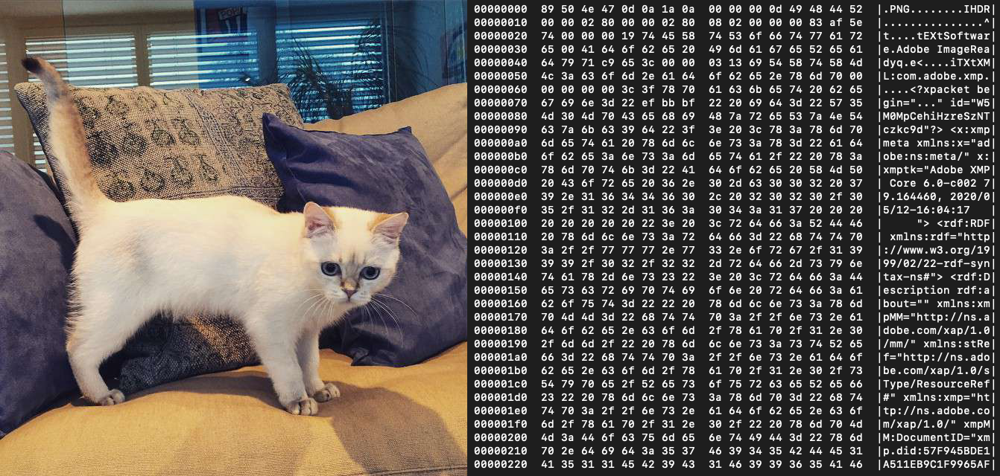
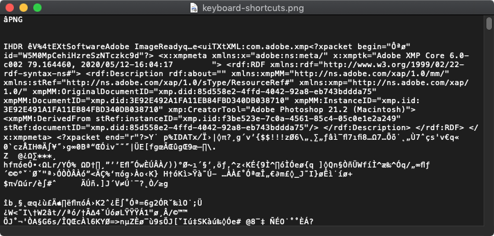

[<](README.md)


# What is Data?

Learn how computers store data, common data types, and how to use them

### Contents

1. [Learning Objectives](#learning-objectives)
1. [Introduction](#introduction) `5 min`
1. [Discussion](#discussion) `5 min`
1. [Keep practicing](#keep-practicing)
1. [References](#references)

## Learning Objectives

Students who complete this lesson will be able to:

- Recall how computers store and use binary data
- Organize data storage amounts by their respective sizes
- List common data types and recall examples of each
- Explain what a collection is and provide examples
- Compare text vs. binary-encoded files
- Use appropriate formats to create data representations of real world examples


## Introduction

Before continuing, complete the [command line crash course](topics-command-line.md#crash-course)

In your group, discuss the following.

- Q1
- Q2
- Q3


### Computers are binary machines

All files on computers are stored as 1's and 0's. Images, text files, music, software, everything—They are all 0's and 1's. The only difference is that they are interpreted differently depending upon what program can open them.



The above [image](assets/img/cat.png) viewed by an application that can read image data, and (right) the binary representation of the file's data. Try it yourself on the [command line](topics-command-line.md):

```bash
hexdump -C /path/to/your/cat.png

```


### Bits, Bytes, Kilobytes, [...]

A bit is considered to be the smallest unit of data measurement. A bit can be either 0 or 1. Computers interpret our intentions and process information by the respective representation of those "instructions" as bits.

Storing and retrieving data locally on a computer has always been faster than transmitting it over a network.


#### Hands on

1. How many bytes? https://mothereff.in/byte-counter


### About file formats

All computer files encode data in one of two different formats—binary or text.

1. **Binary** encoded files are stored as bits (binary 1s and 0s) and can may include multiple types of data in the same file (e.g video and audio). They are more efficient to store and access but can easily become corrupted. Some examples `.jpg`, `.pdf`, and `.mp4`.
1. **Text** encoded files are also stored as bits, but they represent actual characters. You can open text files in many types of editors. Examples include `.txt`, `.html`, and `.cs`.

File encoding [is not the same as](https://kunststube.net/encoding/) character encoding.

If you can open ***and read*** a file in a plain text editor (e.g. [Notepad](https://en.wikipedia.org/wiki/Microsoft_Notepad) on Windows, or [TextEdit](https://en.wikipedia.org/wiki/TextEdit) on Mac) it is a text file. However, if the content of the file appears as mostly garbled text, it is a binary file.

<br>
<sub>A `.png` file opened in TextEdit</sub>


### Examine filetypes in plain text

1. Find examples of each on your own computers  
1. Open them in a plain text editor to verify
1. What clues can you see in the binary formats to tell you about the filetype?


## Common Data Types

Thus, a boolean type requires less memory to store than a string type. The string `"false"` contains 5 characters and thus requires 5 bytes. Zero


A data type defines the kind of data that is stored. This is important for many reasons:


Here are some common types and examples of each:

- Booleans (`true` and `false`)
- Numbers (integers and floats)
- Strings
- Collections

Note: A type is different than it's value. `true` is the value of the type `Boolean`.


## Discussion

Discuss the following:

1. Give an example of each of the types above
2. What type is this? `"3.14"`


## Data Collections

- Arrays
- Objects
- Serialized vs. Unserialized data


e.g. A time series is a collection of observations made sequentially in time.


## Hierarchical Types

- json, xml, etc.


## Discussion

In your group, discuss the following.

- Q1
- Q2
- Q3

## Keep practicing


## References

- [When bandwidth and storage size matters: Bits vs. bytes](https://www.redhat.com/sysadmin/bits-vs-bytes)
