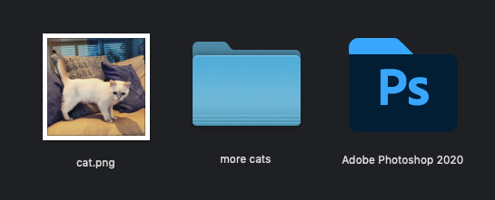
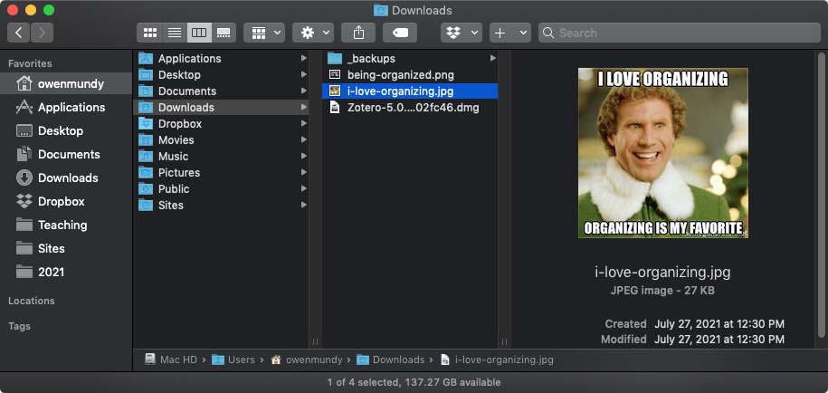
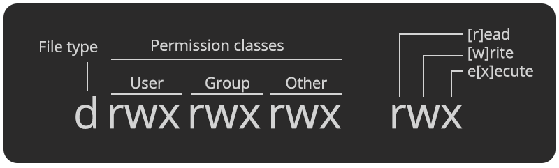
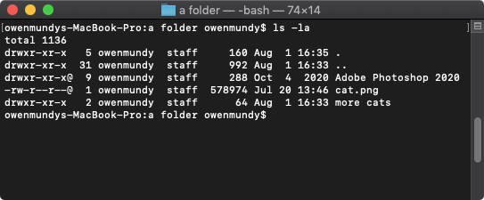
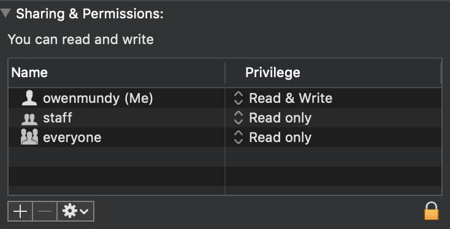
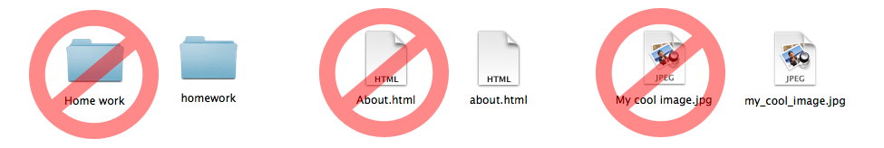
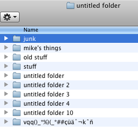
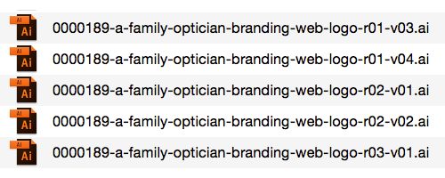
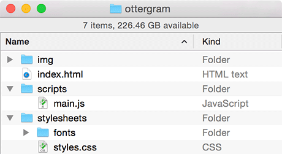

[<](README.md)

# Files, folders, and naming conventions

Learn about all the files on your computer!

### Contents

1. [Learning Objectives](#learning-objectives)
1. [Introduction](#introduction) `5 min`
1. [File extensions](#file-extensions) `5 min`
1. [Hidden files](#hidden-files) `5 min`
1. [File naming conventions](#file-naming-conventions) `5 min`
1. [Discussion](#discussion) `5 min`
1. [Keep practicing](#keep-practicing)
1. [References](#references)

### Learning Objectives

Students who complete the following will be able to:

- Describe basic computing concepts like files, folders, programs, users, and permissions
- List common file extensions and their purpose
- Explain what hidden files do and how to find them
- Demonstrate best practices for naming and organizing files and folders

## Introduction

Complete the [command line crash course](topics-command-line-crash-course.md) and then review and perform the activities with your group.

### Files, folders, & programs

- **Files** - how computers organize and store data about discrete objects.
- **Folders** (a.k.a. "directories") - ([also files](https://www.tutorialspoint.com/unix/unix-directories.htm)) used to organize other files and folders.
- **Programs** (a.k.a. "applications" or "software") - *also*(!) files ([often packaged with other files](https://whatis.techtarget.com/definition/software-package)) that
	- contain instructions for a computer to run.
	- have special permissions that tell the operating system (OS) it is safe to **execute** the instructions within.
- **Force quit** - what you can do if a program stops responding or becomes frozen on [Mac](https://support.apple.com/en-us/HT201276) and [Windows](https://en.wikipedia.org/wiki/Control-Alt-Delete).

### Users and Permissions

- **Users** - a virtual identity that determines what someone can do on a computer.
- **Permissions** - control which users and user groups can perform which actions on every file, folder, and program
	- `[r]ead` - permission to view or open a files
	- `[w]rite` - to modify, save, or delete a file
	- `e[x]ecute` - to run the file (reserved for programs)

### Important directories

- **Hierarchical file system** - how computers organize files inside folders, which are organized inside other folders, and so on, all the way down to the...
- **Root directory** - the "base" or `/` directory on a computer that contains all other directories.
- **Home directory** - every user is the owner of a home directory for their files.
	- Mac: `/Users/<username>` or `~/`
	- Windows: `C:\Users\<username>\`
	- Linux: `/home/<username>` or `~/`

### Hands-on

Perform the following in your group

1. Discuss the screenshot above (with the photo from [Elf](https://www.imdb.com/title/tt0319343/)). Consider:
	- Who is currently logged-in?
	- What is the name of the root directory on this filesystem?
	- When was the file last edited?
	- Where is the user's home directory?

	- What is the full path to the image that is shown?
	- How much space is available on this computer?
	- If you are in the
1. The answers to the above questions are possible thanks to options selected in Mac OS. Doing the following will increase your ability to use a computer:
	- Show the home
	- Show the path
	- Show info
	- Show data on files

1. View and compare the permissions for a file, folder, and program on your computer. What do you notice about the differences?

  
Permissions for the above file, folder, and program in 1) Terminal and 2) using "Get Info"

	- who is the **owner**, **group** (the owner belongs to), and world ("other") permissions

The permissions are broken into groups of threes, and each position in the group denotes a specific permission, in this order: read (r), write (w), execute (x) −

- Finder organization
- Show details
1. Show additional information about your

1. Open the Terminal application
1. Find the username of the current logged-in user - In terminal type: `whoami` and press enter
1. Find a file on your Desktop. What permissions does your user have?

On a Mac you can see these permissions using the terminal (`ls -la`) or with Command + i (Get info).

## File extensions

A file extension is the suffix at the end of a computer file that tells you what type of file it is.

- An extension comes after the period, and is usually 2–4 characters long.
- Extensions tell your operating system (OS) which applications (app) can open which files.
- Most files can be opened with many different apps (e.g. an `.html` file can be opened in a text editor or a web browser), but your OS uses ***only one as the default*** if you double click a file.
- Modern OS's hide the file extension. You can change this setting on both [Mac](https://support.apple.com/guide/mac-help/show-or-hide-filename-extensions-on-mac-mchlp2304/mac) and [Windows](https://www.thewindowsclub.com/show-file-extensions-in-windows)

Here are some common file extensions:

Extension | Filetype | File encoding
--- | --- | ---
`.txt` | A plain text file | Text
`.doc` | Microsoft Word | [Text](https://en.wikipedia.org/wiki/Office_Open_XML)
`.html` | HyperText Markup Language (web pages) | Text
`.css` | Cascading Style Sheet | Text
`.js` | Javascript file | Text
`.jpg`, `.gif`, `.png` | Common image formats | [Binary](https://www.nayuki.io/page/what-are-binary-and-text-files)
`.psd` | Photoshop document | [Binary](https://www.adobe.com/devnet-apps/photoshop/fileformatashtml/)
`.pdf` | Portable Document Format | [Binary](https://www.prepressure.com/pdf/basics/fileformat)
`.unity` | Unity 3D (game engine) scene file | Text ([YAML](https://docs.unity3d.com/Manual/YAMLSceneExample.html))

## Hidden files

All operating systems (OS) hide certain types of configuration and system files by default. While most basic users never know these exist, when you are writing code you'll inevitably need to access or change these files. Files are hidden one of two ways:

1. [Mac](https://www.macworld.co.uk/how-to/show-hidden-files-mac-3520878/) and [Windows](https://www.lifewire.com/what-is-a-hidden-file-2625898) both enable system file and folder hiding via their specific preferences.
1. Unix-based computers (Linux and MacOS) hide configuration files using a preceding `.` period *before* the filename.

### View hidden configuration files on a Mac

Follow these instructions to view hidden files on a Mac:

1. Open the Terminal application.
1. Type `pwd` to confirm you are in your home directory. You should see your Desktop and other files.
1. Type `ls` and press return. You will see all the same files and folders you can see with the Finder.
1. Type `ls -la` and return. Now you can see a list of all these files, as well as all the hidden files and folders.
1. Note the `.Trash` directory. To see the contents type `ls -la .Trash`.
1. Note the `.DS_Store` file [which stores information](https://en.wikipedia.org/wiki/.DS_Store) about icon positions in the Finder. To see the (binary) contents type `cat .DS_Store`.

## File naming conventions

Do you ever have trouble finding or identifying files?

- Share your current file naming convention in your group. What currently is working for you and what is not?
- Can you find examples on your computer of good and bad uses of file naming conventions? Screenshot them and share. It's OK, we've all been there. 🤗

While operating systems are constantly changing how they organize their files, often obscuring the users' access to files with abstractions, if you name your files with a bit of forethought you'll find you can identify them much faster.

### Best Naming Practices

Tips for how to choose the text you use to name your files, folders, even code...

- **Use descriptive names**: Perhaps the most important tip. Do yourself a favor and name files, folders, code, etc., as if a complete stranger (you!) will see it in the future. Don't use `untitled`, `stuff`, `new` in your names.
- **Avoid abbreviations**: How will "future you" remember that `design-1-rtrbith.png` is the design variation where you *"removed the red box in the header"*? This would work better `design-1-red-header-removed.png`
- **Append version numbers and/or dates**: When iterating, don't append the relative term, `new`, to your files. Use an actual version number like `design-v6.psd` or the date `paper-draft2-20210501.psd` so that you know exactly what the file is *AND* your OS will organize the files appropriately.

### Everything is case-sensitive on the internet

When you name ***any*** file or folder that could potentially be viewed in a web browser (e.g. web pages, PDFs, images, javascript, css, folders, and many others) it is essential to:

- Do not use spaces in your filenames: Replace with hyphens, underscores, or camelCase.
- Use a [naming convention](https://en.wikipedia.org/wiki/Naming_convention_(programming)), so you don't have to think when you type your code. Look for an established convention
- **Best practice**: Only use lowercase names with no spaces.

### Popular naming conventions

A table showing common file naming conventions for files, folders, variables, etc. to remove spaces or symbols between words.

Convention | Where common | Examples | Notes
--- | --- | --- | ---
Pascalcase | C# | `UserAccount` | Words are delimited by capital letters
Camelcase | Javascript, CSS | `userAccount` | Words are delimited by capital letters, except the initial word
Snakecase | [Python](https://medium.com/@dasagrivamanu/python-naming-conventions-the-10-points-you-should-know-149a9aa9f8c7), [R](https://style.tidyverse.org/) | `user_account` | Words are delimited by an underscore
Kebabcase |  | `user-account` | Words are delimited by hyphens
Screamingcase |  | `USER_ACCOUNT` | Words are all caps, and or delimited by an underscore

## Discussion

How would you name and organize each of these files:

1. Draft 3 of your Microsoft Word document containing your essay "World War II's Influence on Modern Art in the 1950's"
1. A PDF of the above document that you plan to share on a website.
1. A document containing research you collected while writing the document.

  
It is always a good practice to iterate, whether you are working on a concept, a design, or a paper.
But, name your files with forethought and organization in mind. Left: 😢 no convention in use, names are not descriptive; Right: 🙌 names follow similar convention, include descriptions, iterations, and versions

 

## Keep practicing

## References

- [What is the difference between binary and text files?](https://fileinfo.com/help/binary_vs_text_files)
- [Binary files](http://statmath.wu.ac.at/courses/data-analysis/itdtHTML/node58.html)
- [What Is A File Extension?](https://www.howtogeek.com/356448/what-is-a-file-extension/)
- [Top 10 Unity best practices: Naming Conventions](https://www.reddit.com/r/gamedev/comments/3a1k33/top_10_unity_best_practices_naming_conventions/)
- [Devopedia: Naming Conventions](https://devopedia.org/naming-conventions)
