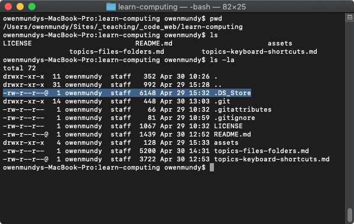

[<](README.md)

# Files, folders, and naming conventions

## Class activity `10 min`

Review the following sections and perform the activity at the end.

### About file formats

All computer files encode data in one of two different formats—binary or text.

1. **Binary** encoded files are stored as bits (binary 1s and 0s) and can may include multiple types of data in the same file (e.g video and audio). They are more efficient to store and access but can easily become corrupted. Some examples `.jpg`, `.pdf`, and `.mp4`.
1. **Text** encoded files are also stored as bits, but they represent actual characters. You can open text files in many types of editors. Examples include `.txt`, `.html`, and `.cs`.

File encoding [is not the same as](https://kunststube.net/encoding/) character encoding.

If you can open ***and read*** a file in a plain text editor (e.g. [Notepad](https://en.wikipedia.org/wiki/Microsoft_Notepad) on Windows, or [TextEdit](https://en.wikipedia.org/wiki/TextEdit) on Mac) it is a text file. However, if the content of the file appears as mostly garbled text, it is a binary file.

<small>A `.png` file opened in TextEdit</small>

#### Activity - Examine filetypes in plain text

1. Find examples of each on your own computers  
1. Open them in a plain text editor to verify
1. What clues can you see in the binary formats to tell you about the filetype?

### File extensions

A file extension is the suffix at the end of a computer file that tells you what type of file it is.

- An extension comes after the period, and is usually 2–4 characters long.
- Extensions tell your operating system (OS) which applications (app) can open which files.
- Most files can be opened with many different apps (e.g. an `.html` file can be opened in a text editor or a web browser), but your OS uses ***only one as the default*** if you double click a file.
- Modern OS's hide the file extension. You can change this setting on both [Mac](https://support.apple.com/guide/mac-help/show-or-hide-filename-extensions-on-mac-mchlp2304/mac) and [Windows](https://www.thewindowsclub.com/show-file-extensions-in-windows)

Here are some common file extensions:

Extension | Filetype | File encoding
--- | --- | ---
`.txt` | A plain text file | Text
`.doc` | Microsoft Word | [Text](https://en.wikipedia.org/wiki/Office_Open_XML)
`.html` | HyperText Markup Language (web pages) | Text
`.css` | Cascading Style Sheet | Text
`.js` | Javascript file | Text
`.jpg`, `.gif`, `.png` | Common image formats | [Binary](https://www.nayuki.io/page/what-are-binary-and-text-files)
`.psd` | Photoshop document | [Binary](https://www.adobe.com/devnet-apps/photoshop/fileformatashtml/)
`.pdf` | Portable Document Format | [Binary](https://www.prepressure.com/pdf/basics/fileformat)
`.unity` | Unity 3D (game engine) scene file | Text ([YAML](https://docs.unity3d.com/Manual/YAMLSceneExample.html))

### Hidden files

All operating systems (OS) hide certain types of configuration and system files by default. While most basic users never know these exist, when you are writing code you'll inevitably need to access or change these files. Files are hidden one of two ways:

1. [Mac](https://www.macworld.co.uk/how-to/show-hidden-files-mac-3520878/) and [Windows](https://www.lifewire.com/what-is-a-hidden-file-2625898) both enable system file and folder hiding via their specific preferences.
1. Unix-based computers (Linux and MacOS) hide configuration files using a preceding `.` period *before* the filename.

#### Activity - View hidden configuration files on a Mac

1. Open the Terminal application.
1. Type `pwd` to confirm you are in your home directory. You should see your Desktop and other files.
1. Type `ls` and press return. You will see all the same files and folders you can see with the Finder.
1. Type `ls -la` and return. Now you can see a list of all these files, as well as all the hidden files and folders.
1. Note the `.Trash` directory. To see the contents type `ls -la .Trash`.
1. Note the `.DS_Store` file [which stores information](https://en.wikipedia.org/wiki/.DS_Store) about icon positions in the Finder. To see the (binary) contents type `cat .DS_Store`.

## File naming conventions

Do you ever have trouble finding files?

One thing to be aware of, is that everything on the internet is case-sensitive. When you name web pages, images and other files, and folders you need to pay attention to naming conventions or your web pages won’t work!
**Best practice**: Only use lowercase names with no spaces.

1. Share your current file naming convention in your group.
1. How would you name or organize each of these files:
 	1. Draft 3 of your Microsoft Word document containing your essay "World War II's Influence on Modern Art in the 1950's"
	1. A PDF of the above document that you plan to share on a website.
	1. A document containing research you collected while writing the document.

1. Discussion:
1. Find examples:
	- Can you find examples on your computer of good and bad uses of file naming conventions? Screenshot them and share. It's OK, we've all been there. 🤗
1. Record the data and your answers to the following:

## References

- [What is the difference between binary and text files?](https://fileinfo.com/help/binary_vs_text_files)
- [Binary files](http://statmath.wu.ac.at/courses/data-analysis/itdtHTML/node58.html)
- [What Is A File Extension?](https://www.howtogeek.com/356448/what-is-a-file-extension/)
