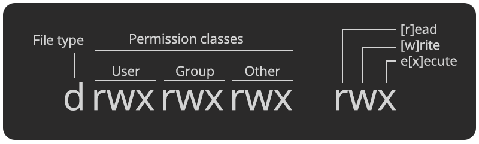

[<](README.md)

# The Filesystem

Learn about all the files on your computer!

### Contents

1. [Introduction](#introduction)
1. [About the filesystem](#about-the-filesystem) `7 min`
1. [Discussion](#discussion) `5 min`
1. [File extensions](#file-extensions) `5 min`
1. [Hidden files](#hidden-files) `5 min`
1. [References](#references)

## Introduction

Review the following sections and perform the activities on your own or with your group.

Learning Objectives

Students who complete the following will be able to:

- Describe basic computing concepts like files, folders, programs, users, and permissions
- List common file extensions and their purpose
- Explain what hidden files do and how to find them
- Demonstrate best practices for filesystem organization

Preparation

Complete the following to prepare for this module

- [Command Line Crash Course](topics-command-line-crash-course.md)

## About the filesystem

### Files, folders, & programs

- **Files** are how computers organize and store data about discrete objects.
- **Folders** (a.k.a. "directories") are ([also files](https://www.tutorialspoint.com/unix/unix-directories.htm)) used to organize other files and folders.
- **Programs** (a.k.a. "applications" or "software") are (*also* files, [often packaged with other files](https://whatis.techtarget.com/definition/software-package)) that contain instructions for a computer to run. Programs need special permissions so the operating system (OS) knows it is safe to **execute** the instructions within.
- **Force quit** - what you can do if a program stops responding or becomes frozen on [Mac](https://support.apple.com/en-us/HT201276) and [Windows](https://en.wikipedia.org/wiki/Control-Alt-Delete).

### Users and Permissions

- A **User** is a virtual identity that determines what someone can do on a computer.
- Every file, folder, and program has a set of **Permissions** which control which users are permitted to:
	- `[r]ead` to view or open a file
	- `[w]rite` to modify, save, or delete a file
	- `e[x]ecute` to run the file

Permissions sets define access for three groups: users, user groups, and everyone else ("world"), and each position in the group denotes a specific permission, in this order: `[r]ead`, `[w]rite`, `e[x]ecute`.

### File Organization

All modern computers use **hierarchical filesystems** to organize files. The directory that contains all other directories in a filesystem is called the **root**. The root directory contains many special files that your operating system (OS) uses for its work.

The location or "address" of a file in a filesystem is the **path**. For example, to make it easier for users to find their documents, the OS gives each their own **home directory** inside the `Users` directory at the following paths:

- Mac: `/Users/<username>`
- Windows: `C:\Users\<username>\`
- Linux: `/home/<username>`
- Shorthand on Mac or Linux: `~/`

As you can see, the root path on Mac/Linux is just `/`, and Windows is `C:`.

## Discussion

### Who are you?

1. Open the Terminal (MacOS) application
1. Find the username of the current logged-in user - In terminal type: `whoami` and press enter
1. Move into the Desktop with `cd Desktop` and list files with permissions `ls -l`
1. What permissions does your user have?

### View permissions for any file

1. In the (MacOS) GUI: Select the file and press Command + i, or right click and select Get Info.
1. Using the terminal
	1. In the Finder, select the containing folder of the file and press Command + C
	1. In Terminal, type `cd ` and then press Command + V to paste the full path of the folder
	1. Type `ls -la` to list the files with their permissions

### Compare permissions

- For a file, folder, and program on your computer.
- For each of the above,
	- Who is the **owner** and **group** (that the owner belongs to)
	- What are the owner, group, and world permitted to do? Copy/paste the permissions set (e.g. `rwxrw-rw-`) into [this "permissions calculator" tool](https://chmod-calculator.com/) to confirm your answer.

### File organization

Answer these prompts about the above screenshot (with the photo from [Elf](https://www.imdb.com/title/tt0319343/)):

1. Who is currently logged-in?
1. What is the name of the root directory on this filesystem?
1. When was the file last edited?
1. Where is the user's home directory?
1. What is the full path to the image that is shown?
1. How much space is available on this computer?

The answers to the above questions are possible thanks to options selected in Mac OS. Do the following on your (MacOS) computer so that you have this same access

1. In Finder, choose View and enable the following options:
	- Show Path Bar
	- Show Status Bar
1. Now you can see your home directory!! Find your home folder and drag it to the Sidebar to make a bookmark.
1. Explore other options in your MacOS Finder or Windows Explorer to see more data about your filesystem, files, etc.

## File extensions

A file extension is the suffix at the end of a computer file that tells you what type of file it is.

- An extension comes after the period, and is usually 2–4 characters long.
- Extensions tell your operating system (OS) which applications (app) can open which files.
- Most files can be opened with many different apps (e.g. an `.html` file can be opened in a text editor or a web browser), but your OS uses ***only one as the default*** if you double click a file.
- Modern OS's hide the file extension. You can change this setting on both [Mac](https://support.apple.com/guide/mac-help/show-or-hide-filename-extensions-on-mac-mchlp2304/mac) and [Windows](https://www.thewindowsclub.com/show-file-extensions-in-windows)

Here are some common file extensions:

Extension | Filetype | File encoding
--- | --- | ---
`.txt` | A plain text file | Text
`.doc` | Microsoft Word | [Text](https://en.wikipedia.org/wiki/Office_Open_XML)
`.html` | HyperText Markup Language (web pages) | Text
`.css` | Cascading Style Sheet | Text
`.js` | Javascript file | Text
`.jpg`, `.gif`, `.png` | Common image formats | [Binary](https://www.nayuki.io/page/what-are-binary-and-text-files)
`.psd` | Photoshop document | [Binary](https://www.adobe.com/devnet-apps/photoshop/fileformatashtml/)
`.pdf` | Portable Document Format | [Binary](https://www.prepressure.com/pdf/basics/fileformat)
`.unity` | Unity 3D (game engine) scene file | Text ([YAML](https://docs.unity3d.com/Manual/YAMLSceneExample.html))

## Hidden files

All operating systems (OS) hide certain types of configuration and system files by default. While most basic users never know these exist, when you are writing code you'll inevitably need to access or change these files. Files are hidden one of two ways:

1. [Mac](https://www.macworld.co.uk/how-to/show-hidden-files-mac-3520878/) and [Windows](https://www.lifewire.com/what-is-a-hidden-file-2625898) both enable system file and folder hiding via their specific preferences.
1. Unix-based computers (Linux and MacOS) hide configuration files using a preceding `.` period *before* the filename.

### View hidden configuration files on a Mac

Follow these instructions to view hidden files on a Mac:

1. Open the Terminal application.
1. Type `pwd` to confirm you are in your home directory. You should see your Desktop and other files.
1. Type `ls` and press return. You will see all the same files and folders you can see with the Finder.
1. Type `ls -la` and return. Now you can see a list of all these files, as well as all the hidden files and folders.
1. Note the `.Trash` directory. To see the contents type `ls -la .Trash`.
1. Note the `.DS_Store` file [which stores information](https://en.wikipedia.org/wiki/.DS_Store) about icon positions in the Finder. To see the (binary) contents type `cat .DS_Store`.

## References

- [What is the difference between binary and text files?](https://fileinfo.com/help/binary_vs_text_files)
- [Binary files](http://statmath.wu.ac.at/courses/data-analysis/itdtHTML/node58.html)
- [What Is A File Extension?](https://www.howtogeek.com/356448/what-is-a-file-extension/)
