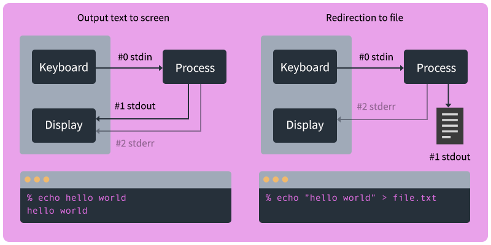

<!-- paginate: true -->

<a class="back-icon" href="../index.html"></a>


# Command Line - Advanced Topics

Going further with the text interface.

<span class="slides-small"><a href="../slides/command-line-advanced.html">slides</a> | <a href="../www/command-line-advanced.html">HTML</a> | <a href="../topics/command-line-advanced.md">md</a></span>

<!--
Presentation comments ...
-->


---


### Contents

1. [Introduction](#introduction)
1. [Bash Scripting - Basics](#bash-scripting---basics)
1. [Bash Scripting - Advanced](#bash-scripting---advanced)
1. [Standard Streams](#standard-streams)
1. [References](#references)


---


## Introduction

Review the following sections and perform the activities on your own or with your group.

Perform the task(s) when you see this 👉  emoji

<details>
<summary>Learning Objectives</summary>

Students who complete the following will be able to:

- Explain
- Edit
- Use

</details>


---

## Bash Scripting - Basics

The following slides cover:

1. The `echo` command and variables
1. For loops in bash
1. The Shebang


---

## Echo and Variables

The [Echo command](https://en.wikipedia.org/wiki/Echo_(command)) outputs the text you pass to it as arguments
```bash
echo hello world
# -> "hello world"
```

Variables allow you to store and reuse values
```bash
x=10
echo "The value of x is ${x}"
# -> "The value of x is 10"
```

Echo can be used with a redirect operator to output text to a file (see below for more on [Standard Streams](#standard-streams))
```bash
echo "Hello world (in a text file)" > testpage.txt
```


---

## Wildcards

- Wildcards (a.k.a. meta characters) are special characters that can stand in place of other characters.
- Use them with commands to match strings (including filenames) of a given criteria
- The asterisk `*` will match one or more occurrences of *any* character, including no character.

```bash
echo *      # Print all files in the current directory (like the `ls` command).
echo a*     # All files starting with an "a"
echo *a*    # All files containing an "a"
echo *.md   # All files ending with an `.md` extension (markdown files)
echo *.jpg  # All files ending with a `.jpg` extension
```

The asterisk can also be used in paths

```bash
echo ~/*                # All files in the home directory
echo /Users/*/D*        # All files starting with "D" in *any* Users directory (one directory deep)
echo ~/Downloads/**/z*  # All files starting with "z" in *any* directory in Downloads (any number of directories deep)
```


---

## Bash Scripting - For loops


Basic for loop structure
```bash
for i in 1 2 3 4 5; do echo $i; done
```

Loop through files in your home folder
```bash
for filename in ~/*; do echo $filename; done
```


---

## The Shebang

- The shebang line script enables a script to be executed as if it were a standalone executable program.
- Add it to the first line of the script file will let you double click it in the GUI, or run it without the preceding program on the command line.

```bash
# instead of
python file.py
# just run
file.py
```


---

## The Shebang

Start by getting the location of the programs on your machine

```bash
which bash
# -> /bin/bash
which python3
# -> /usr/bin/env
```

Therefore a bash script `.sh` should use
```bash
#!/bin/bash
```

And python3 use:
```bash
#!/usr/bin/env python3
```


---

## Bash Scripting - Advanced

The following slides cover:

1. I/O and redirection using Standard Streams 📌


---


## Standard Streams 📌

- Communication between a computer and its environment is known as a *stream*
- Streams can be physical (a keyboard, display, etc.) or virtual (an interactive shell).
- There are three standard streams that [input/output (I/O)](https://en.wikipedia.org/wiki/Input/output) data.


---

## Standard Streams

- When a Unix command is executed, data "flows" as text over one of the three standard streams: standard input (`stdin`), standard output (`stdout`) and standard error (`stderr`).




---

## Standard Streams

This data is sent to the program "input" using **stdin** and output using **stdout**.

```bash
echo "hello world"
# -> "hello world"
```

This error message is output using **stderr**.

```bash
a_program_that_does_not_exist
# -> zsh: command not found: a_program_that_does_not_exist
```


---

## Redirection

- The outcomes of streams can be changed with redirection or a pipe.
- Redirect `>` is used to pass output to either a file or stream.

```bash
echo "line 1 \nline 2 \nline 3" > file.txt
# -> This text will be saved into a new file.
```


---

## Redirection

- Pipe `|` is used to pass output *to another program*.

```bash
cat file.txt # stdout -> all lines of the file
cat file.txt | grep 2 # stdout -> only lines with a "2"
```

```bash
history
# -> displays all shell commands during this session
history | grep cat
# -> displays only commands which contain "cat"
```


---

## References

- [15 Practical Examples of ‘echo’ command in Linux](https://www.tecmint.com/echo-command-in-linux/)
- [10 Practical Examples Using Wildcards to Match Filenames in Linux](https://www.tecmint.com/use-wildcards-to-match-filenames-in-linux/)
- [6 Bash Shell Command Line Chaining Operators in Linux](https://www.thegeekdiary.com/6-bash-shell-command-line-chaining-operators-in-linux/)
- [Bash for loop examples](https://www.cyberciti.biz/faq/bash-for-loop/)
- [Standard streams](https://en.wikipedia.org/wiki/Standard_streams)
- [What Are stdin, stdout, and stderr on Linux?](https://www.howtogeek.com/435903/what-are-stdin-stdout-and-stderr-on-linux/)
