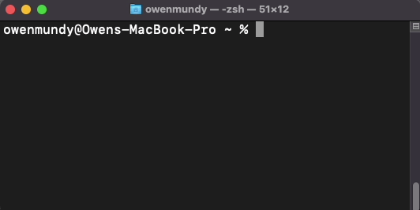
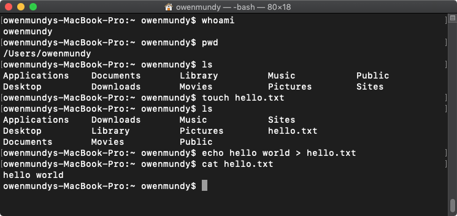

<!-- paginate: true -->

# Command Line Crash Course

A short primer for using the command line

<a href="../slides/command-line-crash-course.html">slides</a> | <a href="../topics/command-line-crash-course.md">md</a>

<!--
Presentation comments ...
-->

---

## Introduction

Review the following sections and perform the activities on your own or with your group.

Perform the task(s) when you see this 👉  emoji

Learning Objectives

Students who complete the following will be able to:

- Explain what the command line is and what it can do
- Open a command line program on their computer and execute basic commands
- Use a web reference to look up shell commands

---

## About the command line

The command line allows you to control your computer via a text interface. Depending on the context, it might also be referred to as a shell, terminal, or console. The following is a quick introduction.

---

## Installation

- Mac - The Terminal application is already installed
- Windows - Install [Git Bash](https://gitforwindows.org/) or [Windows Terminal](https://www.microsoft.com/en-us/p/windows-terminal/9n0dx20hk701)
- Linux - [LXTerminal](https://www.raspberrypi.org/documentation/usage/terminal/) is already installed

---

## Run commands

👉 **Try it out**

Open your command line application (Terminal, etc.) and note the **prompt** — the `$` `%` or `#` symbol — where you will type commands.

1. Type each of the following commands at the prompt, pressing <kbd>return</kbd> each time.
1. If you make a mistake press backspace or <kbd>Ctl</kbd> + <kbd>C</kbd> to cancel.

---

Step | Command | Description 
---: | --- | ---
1 | `whoami` | Display [the username of current user](https://en.wikipedia.org/wiki/Whoami)
2 | `pwd` | Display the full path of your current folder, or [working directory](https://en.wikipedia.org/wiki/Pwd)
3 | `ls` | [List the files](https://en.wikipedia.org/wiki/Ls) in your current directory
4 | `touch hello.txt` | [Create a new file](https://en.wikipedia.org/wiki/Touch_(command)) called hello.txt
5 | `ls` | List files to confirm the new file was created
6 | `echo "hello world" > hello.txt` | Write some text in the new file
7 | `cat hello.txt` | View contents of new file (as in "con[cat](https://en.wikipedia.org/wiki/Cat_(Unix)enate"))
8 | `ping -c 5 google.com` | A [networking utility](https://en.wikipedia.org/wiki/Ping_(networking_utility)) to check the connection to any website.
9 |   | [Search for](https://en.wikipedia.org/wiki/Ls) the command modifier to list files with their modified date.
10 |   | [Search for](https://google.com) the command modifier to list all files, including hidden files.

---

Congratulations! 🎉 You've completed basic commands in a shell.

Click to view example output from the steps.

