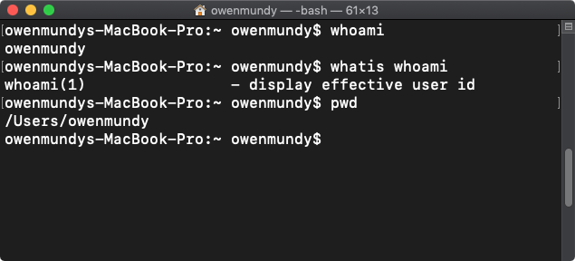
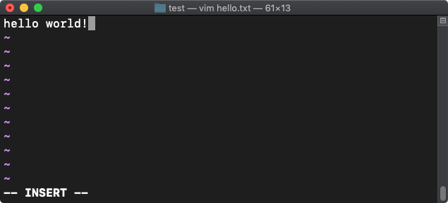
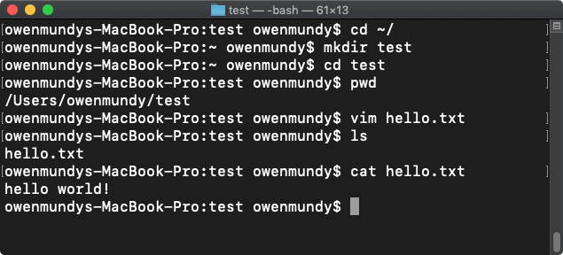

<!-- paginate: true -->

<a class="back-icon" href="../index.html"></a>


# The Command Line

Using the command line is essential to computing proficiency.

<span class="slides-small"><a href="../slides/command-line.html">slides</a> | <a href="../topics/command-line.md">md</a></span>

<!--
Presentation comments ...
-->


---


### Contents

1. [Introduction](#introduction)
1. [About the command line](#about-the-command-line) `5 min`
1. [Navigating the filesystem](#navigating-the-filesystem) `5 min`
1. [Creating and editing files](#creating-and-editing-files) `5 min`
1. [Running programs](#running-programs) `5 min`
1. [Discussion](#discussion) `5 min`
1. [Keep practicing](#keep-practicing)
1. [Assessment](#assessment)
1. [References](#references)


---


## Introduction

Review the following sections and perform the activities on your own or with your group.

Perform the task(s) when you see this 👉  emoji

<details>
<summary>Learning Objectives</summary>

Students who complete the following will be able to:

- Explain what the command line is and common uses
- Open a command line program on their computer and execute basic commands
- Navigate, create, and edit files on their computer using the command line
- Edit and run a Python script using the command line
- Use a web reference to look up shell commands

</details>


---


## About the command line

The command line is a text interface for your computer. You type commands, and the computer operating system (OS) will run them when you press <kbd>return</kbd>.


---

## About the command line

The command line not that different from using a GUI (Graphical User Interface) with a mouse. It allows you to create and edit documents, or manage files and folders on your computer, just as you would with Windows Explorer or the MacOS Finder.

In fact, when you use the GUI, your clicks and interactions with the "[pictures under glass](http://worrydream.com/ABriefRantOnTheFutureOfInteractionDesign/)" on screen are just sending the same commands to the operating system.

Let's see what the command line can do that your mouse *cannot*...


---


### Related terms

Term | Description
--- | ---
OS | Operating System
CLI | [Command Line Interface](https://en.wikipedia.org/wiki/Command-line_interface)
Shell | The application where you use the command line
Bash ("Bourne Again Shell") | A type of shell
Zsh ("Z Shell") |  The new default shell used in macOS Catalina and later
Shell programming | [Programming and running scripts](https://www.tutorialspoint.com/unix/shell_scripting.htm) (e.g. `.sh`) using a shell


---


### 👉  Installation

- Mac - The Terminal application is already installed
- Windows - Install [Git Bash](https://gitforwindows.org/) or use [Windows Terminal](https://www.microsoft.com/en-us/p/windows-terminal/9n0dx20hk701)
- Linux - [LXTerminal](https://www.raspberrypi.org/documentation/usage/terminal/) is already installed


---


### Running commands

[Open](basics.md#find-a-file-or-program) your command line app.

You'll see the command prompt, signified by the `$` `%` or `#` symbol, where you will type each command and press <kbd>return</kbd> to make the computer execute it.




---


#### whoami


👉 Type this command and press <kbd>return</kbd>. If you make a mistake, press <kbd>Ctl</kbd> + <kbd>C</kbd> to cancel.

```bash
whoami
```
The [whoami](https://en.wikipedia.org/wiki/Whoami) command will **return** or **output** your username.

```bash
pwd
```
Use [pwd](https://en.wikipedia.org/wiki/Pwd) (**P**rint **W**orking **D**irectory) to find out *where* you are in the filesystem.


---


#### Parameters

When you type on the command line, the shell that your terminal uses (e.g. bash, zsh, etc.) can also accept parameters that change what the command will do. These are called "flags".

👉 For example, the `id` command (like `whoami`) will return login information, but using the following flags will be more specific.

```bash
id -un
```

👉 The `man` command shows the manual file associated with a command, including all flags. Add the command name at the end.

```bash
man id
```

---


#### which

👉 You can also combine commands. For example, [which](https://en.wikipedia.org/wiki/Which_(command)) returns the file path of other programs on your system.

```bash
which whoami
# -> /usr/bin/whoami
```

The hash symbol `#` is used for comments in bash scripting, and so is skipped by the shell when evaluating the input. These are displayed to show what the output will be.

👉 Special operators can create new commands from many. The double ampersand `&&` runs all of these.

```bash
whoami && pwd && echo Hello world!
# -> <outputs all three in series>
# -> owenmundy
# -> /Users/owenmundy
# -> Hello world!
```


---


## Navigating the filesystem

👉 Let's learn how to move around. First, confirm your location:

```bash
pwd
```
Most commands are abbreviations for the English equivalent of what they perform.

👉 Run these commands and try to guess what they do.

```bash
ls
ls -a
```

---

## ls

If you guessed "list" and "list, show all" you were correct!

[`ls`](https://en.wikipedia.org/wiki/Ls) lists the contents of your present "working directory", and the `-a` flag displays all files.


The `a` displays all files, including those beginning with a `.`, which are hidden configuration files for software.


Adding an `l` ("long form") flag displays the contents' file sizes and last edit dates.


---


👉 Now, `cd` ("**C**hange to a new **D**irectory") and list the files. Where you are?

```bash
cd /
ls -la
```

Using `cd /` changes our current working directory to the [root of the computer](files-folders.md#users-and-permissions), where you'll find files your OS uses.

👉  Return to your home directory (the default location for a new shell) with (a "tilda" <kbd>~</kbd> + <kbd>/</kbd>)

```bash
cd ~/
```


---

## Creating and editing files

Let's make a new folder in our home directory to create some test files.

👉 First, make sure you have a Finder or Explorer window open so you can see the effects of your work in the GUI.

```bash
cd ~/ # confirm you are home
mkdir test # make a new directory called "test"
cd test # change to the directory
pwd # confirm you are in <username>/test
```

---

### Create a new file

👉 Use [touch](https://en.wikipedia.org/wiki/Touch_(command)) to create a new file named "hello.txt":

```bash
touch hello.txt
```

On Windows, Git Bash defaults to the [Vim](https://www.radford.edu/~mhtay/CPSC120/VIM_Editor_Commands.htm) editor. On Mac you can also use [Nano](https://linuxize.com/post/how-to-use-nano-text-editor/).

👉 Either editor can open (or if it doesn't yet exist, create and open) a file we created above hello.txt

```bash
vim hello.txt
```

---

Vim has two modes: *command* and *insert*. In the command mode, you can move around the file, delete text, save, etc. In the insert mode, you can insert text.

👉 To change to the insert mode, press <kbd>i</kbd>. Type some text.



---

👉 Change back to command mode by pressing <kbd>ESC</kbd>, and save your file by pressing <kbd>:</kbd><kbd>w</kbd><kbd>q</kbd> (`:wq`) (write and quit). Once you do this, run the following to confirm the file exists and see its contents.

```bash
ls -la
cat hello.txt
# -> hello world!
```




---

## Running programs

Excellent! Now, in our final section, we'll create and run a Python script with Vim.

👉 Confirm you are still in `<username>/test`, and "clear" the terminal (you can still scroll up to see previous commands)

```bash
pwd
clear
```

👉 Create and open a plain text file with the .py extension.

```bash
vim script.py
```


---

### Add Python code

👉 In the Vim editor, enter insert mode using <kbd>i</kbd>, and paste or type the following:

```python
string1 = "I"
string2 = " <3"
string3 = " the CLI"
joined_string = string1 + string2 + string3
print(joined_string)
```

👉 Press `ESC` and then `:wq` to save and quit the editor. Run your file with:

```bash
python script.py
```

Congratulations! 🎉 &nbsp; You've created a file that runs its own script!

⚠️ Windows 11 users [may need to install Python and use PowerShell](https://docs.microsoft.com/en-us/windows/python/beginners) for this step.

---

## Discussion

Discuss the following with your group and share a short demo on the above with the class.

1. Demonstrate example commands that show
	1. how to navigate the filesystem
	1. how to create files
	1. how to run a program
1. Of the commands you used, which reminded you of concepts you already know about computers?
1. Revisit the learning objectives for this section. Did you accomplish the goals in this lesson? What questions do you have?


---

## Keep practicing

Continue learning the command line:

- Change the text your python file prints and run the script again. **Tip**: Use the up <kbd>↑</kbd> and down <kbd>↓</kbd> arrows on the keyboard to cycle through previous commands.
- Try out the autocomplete feature of the shell by typing the first three letters of a filename and pressing <kbd>Tab</kbd>. If a file or directory that starts with that name exists the shell will fill it in for you.
- [16 Terminal commands every user should know](https://www.techrepublic.com/article/16-terminal-commands-every-user-should-know/)
- [3 command line games for learning Bash the fun way](https://opensource.com/article/19/10/learn-bash-command-line-games)

---

## Assessment

Ready to test your skills? See if you can

1. Try out any commands in [these cheatsheets](https://www.codecademy.com/learn/learn-the-command-line/modules/learn-the-command-line-navigation/cheatsheet).
1. [Write a simple bash script](https://www.linux.com/training-tutorials/writing-simple-bash-script/)
1. [Take a quiz](https://www.proprofs.com/quiz-school/story.php?title=linux-command-line-quiz-485)


### Quiz

1. How can you autocomplete commands once you start typing?


---

## References

- Ubuntu [The Linux command line for beginners](https://ubuntu.com/tutorials/command-line-for-beginners#3-opening-a-terminal)
- Codecademy [List of Command Line Commands](https://www.codecademy.com/articles/command-line-commands)
- Raspberry Pi [Terminal](https://www.raspberrypi.org/documentation/usage/terminal/)
- [Bash navigation](https://learn.co/lessons/bash-navigation-osx)
- Brett Victor [A Brief Rant On The Future Of Interaction Design](http://worrydream.com/ABriefRantOnTheFutureOfInteractionDesign/) (2011)
