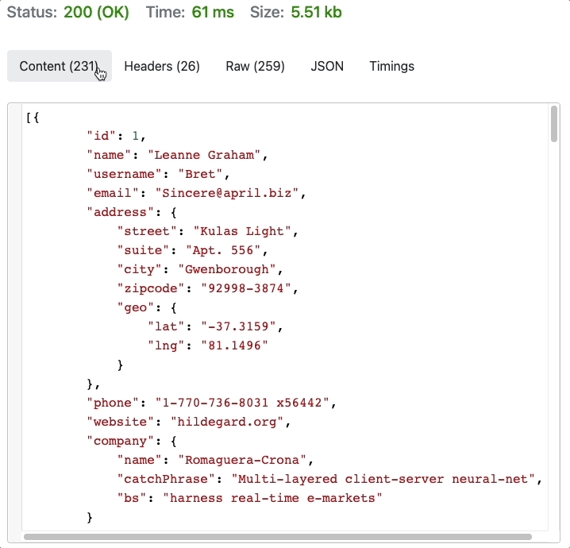

<!-- paginate: true -->

<a class="back-icon" href="../index.html"></a>


# APIs

An introduction to APIs

<span class="slides-small"><a href="../slides/data-apis.html">slides</a> | <a href="../topics/data-apis.md">md</a></span>

<!--
Presentation comments ...
-->


---


### Contents

1. [Introduction](#introduction), [Required tools](#required-tools)
1. [About APIs](#about-apis)
1. [APIs are like search engines](#apis-are-like-search-engines)
1. [Make an API request](#make-an-api-request)
1. [Test an API in the browser](#test-an-api-in-the-browser)
1. [National Weather Service API](#national-weather-service-api)
1. [API authentication](#api-authentication)
1. [Why are most APIs free?](#why-are-most-apis-free)
1. [Keep practicing](#keep-practicing), [References](#references)
1. [Use Postman to test APIs](#use-postman-to-test-apis)


---


## Introduction

Review the following sections and perform the activities on your own or with your group.

Perform the task(s) when you see this 👉  emoji

<details>
<summary>Learning Objectives</summary>

Students who complete the following will be able to:

- Define essential API terms such as authentication, request, response, client, and server
- List methods for connecting to APIs
- Explain why some APIs require authentication
- Use different clients to access data from the National Weather Service and other APIs

</details>

<details>
<summary>Preparation</summary>

Complete the following to prepare for this module

- [Command Line Crash Course](command-line-crash-course.md)
- [Learn Computing: Data Basics](data-basics.md)

</details>


---

## Required tools

👉 Install these tools now to use them later in this presentation

1. [JSON Viewer](https://chrome.google.com/webstore/detail/json-viewer/gbmdgpbipfallnflgajpaliibnhdgobh?hl=en-US) browser extension
1. (optional) [Postman](https://www.postman.com/) (account required)


---

## Application Program Interface

An API is a software service that provides data or functionality, usually to other software.


1. A **Client** (web page, mobile or desktop app) makes a **request**
1. The **Server** processes the request, queries a **database** if needed
1. Server sends **response**, and client does something with the **data**


---

## API examples

Any time you access the internet or use a mobile app, you're using an API.

- [Google Fonts API](https://fonts.google.com/) provides custom typefaces for websites through a free web service
- [Leaflet](https://leafletjs.com/) uses tiles from [OpenStreetMap API](https://www.openstreetmap.org/) to display interactive maps and data
- Social media apps ([Twitter](https://developer.twitter.com/en/docs/twitter-api), [Instagram](https://www.instagram.com/developer/), etc.) use APIs to retrieve and upload data


<div class="caption slides-small">
	*While "API" can also refer to a specification, or how a standard is exposed, this presentation discusses web services.
</div>


---

## APIs are like search engines

When using an API for data, the process is essentially the same

1. Using a browser (client), you enter terms and click search in a UI to make a request
1. The server processes your request, queries their database
1. And returns a response (HTML of results), which the browser renders as a page.

The key difference between "interfaces" they provide

- A search engine interface makes data usable for humans in a GUI
- APIs provide an **interface to machine-readable data for programs**.


---

## Make an API request

The method you use to send an API request depends on your context. For testing:

- Use a web browser
- Use an API-testing client like [REQBIN](https://reqbin.com/) or Postman
- Use `wget` or `curl` on a command line

If you are coding an application:

- API creators often publish SDKs (development kits) to simplify requests
- Most languages have built-in code for asynchronous requests, like Javascript's [`$.ajax()`](https://www.w3schools.com/jquery/jquery_ref_ajax.asp) or [`fetch()`](https://developer.mozilla.org/en-US/docs/Web/API/Fetch_API/Using_Fetch)


---

## Test an API in the browser

Any web browser can send a request to a public API via it's **endpoint** (the URL that provides specific data or functionality).

This National Weather Service (NWS) API endpoint returns JSON data about its status: (click to view) 👉  <a href="https://api.weather.gov/" target="_blank">https://api.weather.gov/</a>

```json
{
  "status": "OK"
}
```

<div class="caption slides-small">

If you installed <a href="https://chrome.google.com/webstore/detail/json-viewer/gbmdgpbipfallnflgajpaliibnhdgobh?hl=en-US" target="_blank">JSON Viewer</a> then it will display formatted data like above.

</div>

Of common software-independent, machine readable data exchange formats, [JSON](https://www.w3schools.com/js/js_json_intro.asp) is most popular (over [XML](https://www.w3schools.com/xml/xml_whatis.asp)) because it is lightweight and easy to use with Javascript.


---

## National Weather Service API

Their [documentation](https://www.weather.gov/documentation/services-web-api) says to get a forecast, we send a request with our current (<a href="https://en.wikipedia.org/wiki/Decimal_degrees" target="_blank">decimal</a>) latitude and longitude to the `/points` endpoint, formatted like:

```markdown
https://api.weather.gov/points/{latitude},{longitude}
```

For <a href="https://www.latlong.net/place/davidson-nc-usa-10313.html" target="_blank">Davidson College</a> use 👉 <a href="https://api.weather.gov/points/35.499302,-80.848686" target="_blank">https://api.weather.gov/points/35.499302,-80.848686</a>

The response includes several data points, like our grid office `gsp` and position `116,76`

```json
"forecast": "https://api.weather.gov/gridpoints/GSP/116,76/forecast",
"forecastHourly": "https://api.weather.gov/gridpoints/GSP/116,76/forecast/hourly",
```


---

## National Weather Service API

Using the `/gridpoints` endpoint we can send a new request to get the forecast

👉 https://api.weather.gov/gridpoints/GSP/116,76/forecast

```json
"periods": [{
        "name": "Today",
        "temperature": 78,
        "icon": "https://api.weather.gov/icons/land/day/sct?size=medium",
        "shortForecast": "Mostly Sunny",
    },{
        "name": "Tonight",
        "temperature": 62,
        "icon": "https://api.weather.gov/icons/land/night/rain_showers,20?size=medium",
        "shortForecast": "Slight Chance Rain Showers",
}]
```

The response includes the time, temperature, conditions, and links to icons:

 


---


## API authentication

- The first example used free, open data from the U.S. government, but many APIs require **authentication**, which means you need to create an account and make requests with a special **key** to verify your identity.
- API creators use authentication to prevent abuse. If you make too many requests your key may temporarily stop working (the NWS rate limit = [5 seconds](https://www.weather.gov/documentation/services-web-api)).
- It is essential to **read an API's documentation** to learn how to use their endpoints, and other requirements.


---

## Why are most APIs free?

Companies build APIs for various reasons:

1. To allow access to data and software used by employees in a company
1. To provide data and functions for their public mobile apps
1. To encourage developers to build 3rd party apps that drive users and engagement
1. Free access to services makes other companies to increase dependency


---

## Why are most APIs free?

<div class="twocolumn">
<div class="col">

<a href="../assets/img/data-apis/data-apis-taylor-swift.png" target="_blank"></a>

</div>
<div class="col">

- The Instagram app is just another type of client.
- It relies on their API to collect your data and render information and media in an interface.
- Like many other companies, they give free, but limited access to their users' data [to 3rd party developers](https://www.instagram.com/developer/) in order to drive engagement.

</div>
</div>


---

<div class="twocolumn">
<div class="col">

<h2>Use REQBIN to test APIs</h2>

Go to [REQBIN](https://reqbin.com/)

👉 Create a new `GET` request with this URL and click Send

<pre><code class="small block">https://jsonplaceholder.typicode.com/users
</code></pre>

You will see `Status: 200 OK` and a collection of "users" if your request was successful.

<div class="caption slides-small">
	*<a href="https://jsonplaceholder.typicode.com/" target="_blank">JSON Placeholder</a> is a free fake API for testing
</div>

</div>
<div class="col">

<a href="../assets/img/data-apis/data-apis-reqbin.gif"></a>

</div>
</div>


---

## URL anatomy

The parts of this URL `https://jsonplaceholder.typicode.com/users`

- **HTTPS** (Hypertext Transfer Protocol Secure) - enables secure (encrypted) communication over a computer network
- **jsonplaceholder.typicode.com** - the API host
- **/users** - the endpoint

[Request methods](http://www.w3schools.com/tags/ref_httpmethods.asp) are standards for exchanging data between clients and servers:

- **GET** - *requests* data, parameters are included in the URL so can be bookmarked https://www.google.com/search?q=cats
- **POST** - *sends* data in the HTTP message body so has no length restrictions


---

<div class="twocolumn2x1">
<div class="col">

<h2>👉  API Practice</h2>

Continue exploring APIs with a browser, [REQBIN](https://reqbin.com/), or Postman using the following [No Auth APIs](https://mixedanalytics.com/blog/list-actually-free-open-no-auth-needed-apis/).

- [Bored API](https://www.boredapi.com/documentation) - Get a new random <a href="http://www.boredapi.com/api/activity/" target="_blank">/activity</a>
- [Random User Generator](https://randomuser.me/) - <a href="https://randomuser.me/api/" target="_blank">/api</a>
- [JokeAPI](https://sv443.net/jokeapi/v2/) - Random jokes <a href="https://v2.jokeapi.dev/joke/Any?blacklistFlags=nsfw,religious,political,racist,sexist,explicit" target="_blank">/joke</a>
- [IP Geolocation API](https://freegeoip.app/) - Data about your present location <a href="https://freegeoip.app/json/" target="_blank">/json</a> 🔑
- [Disney API](https://disneyapi.dev/docs) - 7438 [characters](https://api.disneyapi.dev/character)! 
- ~~[CATAAS](https://cataas.com/#/) - Random images of cats <a href="https://cataas.com/cat/says/i%20love%20APIs?size=50&color=white" target="_blank">/cat/says</a>~~ (see comments)


<!-- APIs come and go... -->

<!-- - [faker.hook.io](https://fakerjsdocs.netlify.app/) uses [faker.js](https://github.com/marak/Faker.js/) - [name.findName&locale=de](http://faker.hook.io/?property=name.findName&locale=de), [hacker.phrase](http://faker.hook.io/?property=hacker.phrase), [companyName](http://faker.hook.io/?property=company.companyName) ([see list](http://faker.hook.io/?property=)) -->
<!-- - [fakercloud](https://fakercloud.com/api) 🔑 -->


</div>
<div class="col">

<a href="../assets/img/data-apis/i-love-APIs-2.jpg"></a>

</div>
</div>


---

## 👉  API Practice

API collections to explore. If authentication is required you need to register with them first.

- [No Auth APIs](https://mixedanalytics.com/blog/list-actually-free-open-no-auth-needed-apis/) - Big List of Free and Open Public APIs (No Auth Needed)
- [Public APIs](https://github.com/public-apis/public-apis) - A collective list of free APIs for use in software and web development
- [apilist.fun](https://apilist.fun/) - A collective list of APIs
- [Data / Functionality API Resource List](https://docs.google.com/spreadsheets/d/196CgwxBIkX5v6VeitOFWTYfd07OU_5A-HC4Gu7gy6xE/edit#gid=0) - My own list


---

## Digital Public Library of America (DPLA)

- Fetch data about items in [dp.la](https://dp.la/) collection
- [docs](https://pro.dp.la/developers/api-codex) - free | auth: **🔑 required**
- [/items](https://pro.dp.la/developers/requests#simple) = `http://api.dp.la/v2/items?q=kittens&api_key=API_KEY`
- Used by - [Historical GIFs](https://twitter.com/dpladotgif) ([code](https://github.com/dogrdon/accidentalculture)) | [Term vs Term](https://owenmundy.com/work/term-vs-term/index.php?q1=cats&q2=dogs)

<!--
<a href="../assets/img/data-apis/data-apis-dlpa-response-cropped.png"></a>
-->

```json
"creator": ["Jones, Leslie, 1886-1967"],
"title": ["Kittens"],
"subject": [
    {"name": "Cats"},
    {"name": "Baby animals"}
],
"format": [
    "Photographs",
    "Glass negatives"
],
```
[link to above object](https://www.digitalcommonwealth.org/search/commonwealth:6682xj30d)

---

## Wikipedia

- Retrieve articles and metadata from [wikipedia.org](https://wikipedia.org)
- [docs](http://www.mediawiki.org/wiki/API:Main_page) - free | auth: no / yes (🔑 for bots)
- [/query](https://en.wikipedia.org/w/api.php?action=help&modules=query) = `https://en.wikipedia.org/w/api.php?format=json&action=query&titles=cat&prop=revisions&rvprop=content`
- Used by - [Wikiscanner](https://web.archive.org/web/20160314095050/http://virgil.gr/wikiscanner/) ([2002-07](https://en.wikipedia.org/wiki/WikiScanner))

<!--
<a href="../assets/img/data-apis/data-apis-wikipedia-cropped.png"></a>
-->

```json
"title": "Cat",
"revisions": [{
    "contentformat": "text/x-wiki",
    "contentmodel": "wikitext",
    "*": "{{Short description|Domesticated felid species}}
        {{About|the species that is commonly kept as a pet|the cat family|Felidae|other
        uses|Cat (disambiguation)|and|Cats (disambiguation)}}"
}]
...
```


---

## OpenSecrets

- Retrieve data about money in politics from [opensecrets.org](http://www.opensecrets.org/)
- [docs](https://www.opensecrets.org/resources/create/api_doc.php) - free | auth: **🔑 required** | non-commercial only | limit: 200/day
- [/getLegislators](https://www.opensecrets.org/api/?method=getLegislators&output=doc) = `https://www.opensecrets.org/api/?method=getLegislators&id=WV&apikey=API_KEY`
- [/candIndByInd](https://www.opensecrets.org/api/?method=candIndByInd&output=doc) [📄](https://www.opensecrets.org/downloads/crp/CRP_Categories.txt) = `https://www.opensecrets.org/api/?method=candIndByInd&output=json&cid=N00032838&cycle=2018&ind=E1210&apikey=API_KEY` [🤨](http://www.opensecrets.org/industries/recips.php?Ind=E1210&amp;cycle=2022&amp;Mem=Y&amp;sortorder=U)

```json
{ "response":{
        "cand_name":"Manchin, Joe", "cid":"N00032838", "cycle":"2018",
        "industry":"Coal mining", "chamber":"S", "party":"D", "state":"West Virginia",
        "total":"40550", "indivs":"29050", "pacs":"11500", "rank":"6",
        "origin":"Center for Responsive Politics", "source": "...", "last_updated":"06\/10\/19"
    }
}
```

---

## Spotify

- Retrieve metadata about music artists, albums, and tracks using [Spotify Web API endpoints](https://developer.spotify.com/documentation/web-api/).
- [docs](https://developer.spotify.com/documentation/web-api/reference/#/) - free | auth: [yes](https://developer.spotify.com/documentation/general/guides/authorization/) 🔑 - make an app, then get token with appropriate permissions
- [/me](https://developer.spotify.com/documentation/web-api/reference/#/operations/get-current-users-profile) = `https://api.spotify.com/v1/me`
- [/me/top/artists](https://developer.spotify.com/documentation/web-api/reference/#/operations/get-users-top-artists-and-tracks) = `https://api.spotify.com/v1/me/top/artists`


1. Login to the [developer dashboard](https://developer.spotify.com/dashboard/) and [create an app](https://developer.spotify.com/dashboard/applications)
1. Test the [`/me`](https://developer.spotify.com/console/get-current-user/) endpoint in their Console. Click Get Token and select all required scopes.
1. Click Try It to make a request or copy your token and the endpoint you wish to test into [Postman](https://blog.postman.com/spotify-music-discovery-with-postman/).


---

## Keep practicing

- Learn Computing: Data Basics [slides](../slides/data-basics.html) | [markdown](../topics/data-basics.md)
- Learn Computing: Data Types [slides](../slides/data-types.html) | [markdown](../topics/data-types.md)
- Learn Computing: Data Cleaning [slides](../slides/data-cleaning.html) | [markdown](../topics/data-cleaning.md)
- Learn Computing: APIs [slides](../slides/data-apis.html) | [markdown](../topics/data-apis.md)

---

##  Notes/Tips

- APIs are always changing - Before Facebook (and Instagram) added restrictions to their APIs anyone (artists, researchers, [anti-press governments](https://www.scu.edu/ethics-spotlight/social-media-and-democracy/weaponization-of-social-media-by-authoritarian-states/)) could download entire databases. Thanks to various cultural works and activism this has changed (see [iknowwhereyourcatlives.com](https://iknowwhereyourcatlives.com/), [givememydata.com](https://givememydata.com/)).
- If you are building an interface or processing the data, save the API result in a local .json file and point to that URL so you don't exceed the API rate limit when testing,


---

## References

- [Postman Tutorial: How to use Postman Tool for API Testing](https://www.guru99.com/postman-tutorial.html) (2021)


---

## More on APIs


---

<div class="twocolumn">
<div class="col">

<h2>Use Postman to test APIs</h2>

[Postman](https://www.postman.com/) is an API development client. Once you [install](https://www.postman.com/downloads/) the app and [login](https://identity.getpostman.com/signup):

👉 Create a new `GET` request with this URL and click Send

<pre><code class="small block">https://jsonplaceholder.typicode.com/users
</code></pre>

You will see `Status: 200 OK` and a collection of "users" if your request was successful.

<div class="caption slides-small">
	*<a href="https://jsonplaceholder.typicode.com/" target="_blank">JSON Placeholder</a> is a free fake API for testing
</div>

</div>
<div class="col">

<a href="../assets/img/data-apis/postman-jsonplaceholder-users.png"></a>

</div>
</div>


---

## Authentication with Postman

To reuse a token across multiple (e.g. Spotify) requests in Postman:

1. Create a collection named Spotify
1. In the Spotify collection
    1. In Variables - Add a new variable named `token`. Paste the token in **value** (use select all!).
    1. In Authorization - Set **Type** to OAuth2.0 and then reference the variable with `{{token}}`
1. In Authorization for each request, choose "inherit from parent" to use the token

Note: APIs are not always perfect. For example, the [/me/top/{type}](https://developer.spotify.com/console/get-current-user-top-artists-and-tracks/) endpoint is not documented well. You have to enter values for ALL parameters to make it work.
