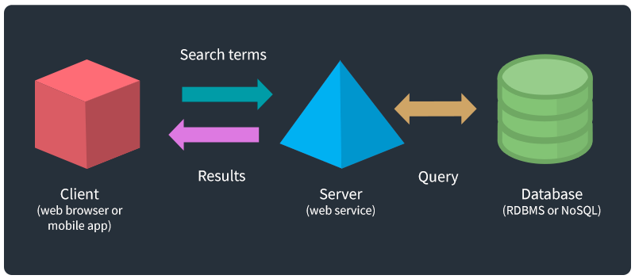
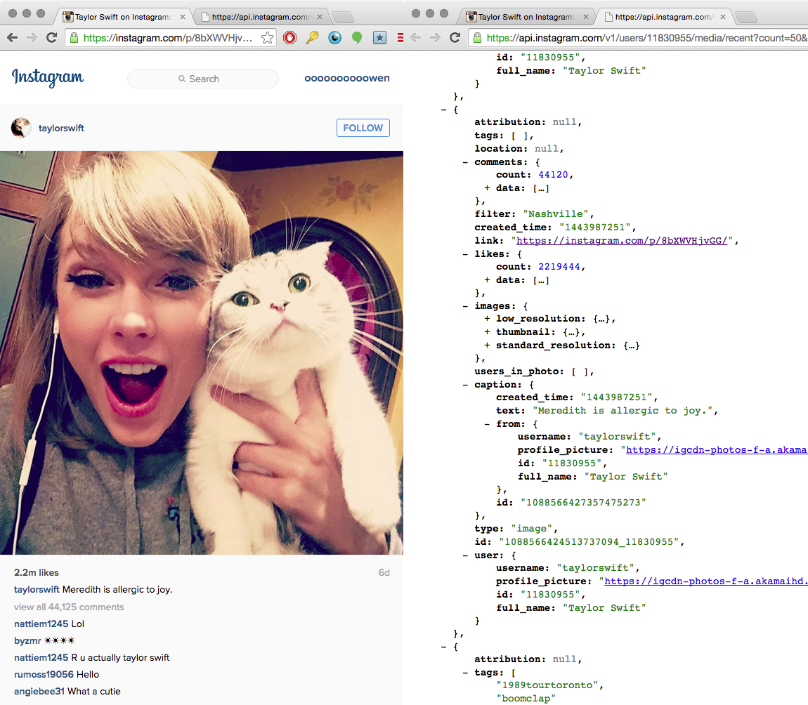

<!-- paginate: true -->

[<](../README.md)

# APIs

Learn how to connect and retrieve data from APIs

<a href="../slides/data-apis.html">slides</a> | <a href="../topics/data-apis.md">markdown</a>

<!--
Presentation comments ...
-->

---

### Contents

1. [Introduction](#introduction)
1. [About APIs](#about-apis) `5 min`
1. [The Response](#the-response) `5 min`
1. [The Client and Request](#the-client-and-request) `5 min`
1. [Why are many APIs free?](#why-are-many-apis-free) `5 min`
1. [Connect to an API](#connect-to-an-api) `5 min`
1. [Use Postman to test APIs](#use-postman-to-test-apis) `5 min`
1. [Keep practicing](#keep-practicing)
1. [References](#references)

---

## Introduction

Review the following sections and perform the activities on your own or with your group.

Perform the task(s) when you see this 👉  emoji

Learning Objectives

Students who complete the following will be able to:

- Define
- List
- Explain
- Use

Preparation

Complete the following to prepare for this module

- [Command Line Crash Course](command-line-crash-course.md)
- [Learn Computing: Data Basics](data-basics.md)

---

## About APIs

An Application Program Interface (API) is a software service that provides data or functionality, usually directly to other software.

1. **Client** (user w/web browser, mobile or desktop app) makes a **request**
1. **Server** processes the request, queries **database** if needed
1. Server sends **response**, and client does something with the **data**

---

## Using an API is similar to a search engine.

1. Using a browser (client), you add terms and click search to make a request
1. The server processes your request, queries their database
1. And returns a response (HTML of results), which the browser renders as page.

The key difference: search engines provide an interface for humans, while APIs provide an interface, and the machine-readable data (usually JSON), for programs.

---

## The response

Every mobile app is a client, that sends and receives JSON data and media, and then renders it as an interface.

---

## Digital Public Library of America (DPLA)

Consider the DPLA. You can search their [website](https://dp.la/) to retrieve data about items in their collection (e.g. a search for cats [dp.la/search?q=cats](https://dp.la/search?q=cats)).

With their [API](https://pro.dp.la/developers) you can access data for other uses: [Historical GIFs](https://twitter.com/dpladotgif) ([code](https://github.com/dogrdon/accidentalculture)) and [Term vs Term](https://owenmundy.com/work/term-vs-term/index.php?q1=cats&q2=dogs)

- Free | auth required | [documentation](https://pro.dp.la/developers/api-codex)
- Request: http://api.dp.la/v2/items?q=cats&api_key=YOUR_API_KEY , Response

---

## Why are many APIs free?

Companies build APIs for various reasons:

1. To provide data and functions for their public mobile apps
1. To allow access to data and software used by employees in a company
1. To encourage developers to build 3rd party apps that drive users and engagement
1. Free access to services makes other companies to increase dependency

---

## Server and database

A server may or may not use a database to store and save data.

Protect some data while giving access to other data.
Limited access to data and functions is given through predefined methods.
Usually requires authentication via a key. This also allows the service to monitor or charge for usage and prevent abuse.

Provided for many reasons:

Thousands available for anything you can imagine.

---

## How to test APIs in the browser

using curl (command line) or

---

## The Client and Request

Many APIs can be accessed directly in a browser.

Requests must

For example, Twitter
https://developer.twitter.com/en/docs/twitter-api/v1/data-dictionary/object-model/tweet

---

## Use Postman to test APIs

[Postman](https://www.postman.com/) is an API development client.

It is available [on the web](go.postman.co/home) and as a [native desktop app for Mac, Windows, and Linux](https://www.postman.com/downloads/).

---

## More examples

---

## Keep practicing

- Learn Computing: Data Basics [slides](../slides/data-basics.html) | [markdown](../topics/data-basics.md)
- Learn Computing: Data Types [slides](../slides/data-types.html) | [markdown](../topics/data-types.md)
- Learn Computing: Data Cleaning [slides](../slides/data-cleaning.html) | [markdown](../topics/data-cleaning.md)
- Learn Computing: APIs [slides](../slides/data-apis.html) | [markdown](../topics/data-apis.md)

---

## References

-
