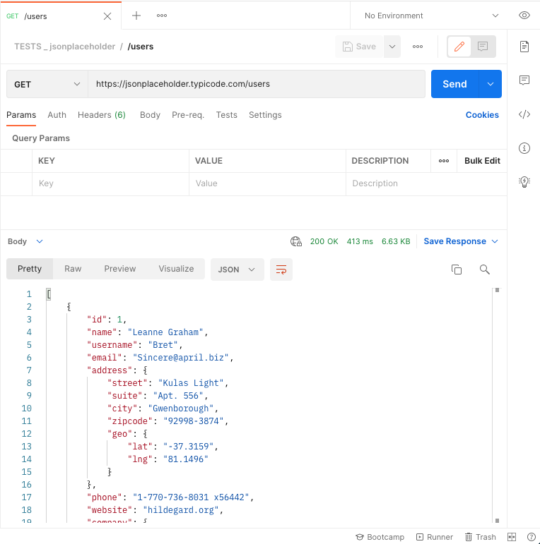

<!-- paginate: true -->

<style>
.twocolumn {
   display: grid;
   grid-template-columns: 1fr 1fr;
   grid-gap: 20px;
   text-align: left;
}
</style>


[<](../README.md)


# APIs

An introduction to using APIs

<sup class="small"><a href="../slides/data-apis.html">slides</a> | <a href="../topics/data-apis.md">markdown</a></sup>

<!--
Presentation comments ...
-->


---


### Contents

1. [Introduction](#introduction)
1. [About APIs](#about-apis)
1. [APIs are like search engines](#apis-are-like-search-engines)
1. [Make an API request](#make-an-api-request)
1. [Test an API in the browser](#test-an-api-in-the-browser)
1. [National Weather Service API](#national-weather-service-api)
1. [API authentication](#api-authentication)
1. [Why are most APIs free?](#why-are-most-apis-free)
1. [Use Postman to test APIs](#use-postman-to-test-apis)
1. [Keep practicing](#keep-practicing)
1. [References](#references)


---


## Introduction

Review the following sections and perform the activities on your own or with your group.

Perform the task(s) when you see this 👉  emoji

<details>
<summary>Learning Objectives</summary>

Students who complete the following will be able to:

- Define essential API terms such as authentication, request, response, client, and server
- List methods for connecting to APIs
- Explain why some APIs require authentication
- Use different clients to access data from the National Weather Service and other APIs

</details>

<details>
<summary>Preparation</summary>

Complete the following to prepare for this module

- [Command Line Crash Course](command-line-crash-course.md)
- [Learn Computing: Data Basics](data-basics.md)

</details>


---

## Required tools

👉 Install these tools now to use them later in this presentation

1. [JSON Viewer](https://chrome.google.com/webstore/detail/json-viewer/gbmdgpbipfallnflgajpaliibnhdgobh?hl=en-US) browser extension
1. Create a [Postman Account](https://identity.getpostman.com/signup) and [install their client](https://www.postman.com/downloads/)


---

## About APIs

An Application Program Interface (API) is a software service that provides data or functionality, usually to other software.


1. A **Client** (web page, mobile or desktop app) makes a **request**
1. The **Server** processes the request, queries a **database** if needed
1. Server sends **response**, and client does something with the **data**


---

## API examples

Any time you access the internet or use a mobile app, you're using an API.

- [Google Fonts API](https://fonts.google.com/) provides custom typefaces for websites through a free web service
- [Leaflet](https://leafletjs.com/) uses tiles from [OpenStreetMap API](https://www.openstreetmap.org/) to display interactive maps and data
- Social media apps ([Twitter](https://developer.twitter.com/en/docs/twitter-api), [Instagram](https://www.instagram.com/developer/), etc.) use APIs to retrieve and upload data


<div class="caption small">

*While "API" can also refer to a specification, or how a standard is exposed, this presentation discusses web services.

</div>


---

## APIs are like search engines

When using an API for data, the process is essentially the same

1. Using a browser (client), you enter terms and click search in a UI to make a request
1. The server processes your request, queries their database
1. And returns a response (HTML of results), which the browser renders as a page.

The key difference between "interfaces" they provide

- A search engine interface makes data usable for humans in a GUI
- APIs provide an **interface to machine-readable data for programs**.


---

## Make an API request

The method you use to send an API request depends on your context. For testing:

- Use a web browser
- Use an API-testing client like Postman
- Use `wget` or `curl` on a command line

If you are coding an application:

- API creators often publish SDKs (development kits) to simplify requests  
- Most languages have built-in code for asynchronous requests, like Javascript's [`$.ajax()`](https://www.w3schools.com/jquery/jquery_ref_ajax.asp) or [`fetch()`](https://developer.mozilla.org/en-US/docs/Web/API/Fetch_API/Using_Fetch)


---

## Test an API in the browser

Any web browser can send a request to a public API via it's **endpoint** (the URL that provides specific data or functionality).

This National Weather Service (NWS) API endpoint returns JSON data about its status: (click to view) 👉  <a href="https://api.weather.gov/" target="_blank">https://api.weather.gov/</a>

```json
{
  "status": "OK"
}
```

<div class="caption small">

If you installed <a href="https://chrome.google.com/webstore/detail/json-viewer/gbmdgpbipfallnflgajpaliibnhdgobh?hl=en-US" target="_blank">JSON Viewer</a> then it will display formatted data like above.

</div>

Of common software-independent, machine readable data exchange formats, [JSON](https://www.w3schools.com/js/js_json_intro.asp) is most popular (over [XML](https://www.w3schools.com/xml/xml_whatis.asp)) because it is lightweight and easy to use with Javascript.


---

## National Weather Service API

Their [documentation](https://www.weather.gov/documentation/services-web-api) says to get a forecast, we send a request with our current (<a href="https://en.wikipedia.org/wiki/Decimal_degrees" target="_blank">decimal</a>) latitude and longitude to the `/points` endpoint, formatted like:

```
https://api.weather.gov/points/{latitude},{longitude}
```

For <a href="https://www.latlong.net/place/davidson-nc-usa-10313.html" target="_blank">Davidson College</a> we use 👉 <a href="https://api.weather.gov/points/35.499302,-80.848686" target="_blank">https://api.weather.gov/points/35.499302,-80.848686</a>

The response includes several data points, like our grid office `gsp` and position `116,76`

```json
"forecast": "https://api.weather.gov/gridpoints/GSP/116,76/forecast",
"forecastHourly": "https://api.weather.gov/gridpoints/GSP/116,76/forecast/hourly",
```


---

## National Weather Service API

Using the `/gridpoints` endpoint we can send a new request to get the forecast

👉 https://api.weather.gov/gridpoints/GSP/116,76/forecast

```json
"periods": [{    
        "name": "Today",
        "temperature": 78,
        "icon": "https://api.weather.gov/icons/land/day/sct?size=medium",
        "shortForecast": "Mostly Sunny",
    },{
        "name": "Tonight",
        "temperature": 62,
        "icon": "https://api.weather.gov/icons/land/night/rain_showers,20?size=medium",
        "shortForecast": "Slight Chance Rain Showers",
}]
```

The response includes the time, temperature, conditions, and links to icons:

 


---


## API authentication

- The first example used free, open data from the U.S. government, but many APIs require **authentication**, which means you need to create an account and make requests with a special **key** to verify your identity.
- API creators use authentication to prevent abuse. If you make too many requests your key may temporarily stop working (the NWS rate limit = [5 seconds](https://www.weather.gov/documentation/services-web-api)).
- It is essential to **read an API's documentation** to learn how to use their endpoints, and other requirements.


---

## Why are most APIs free?

Companies build APIs for various reasons:

1. To allow access to data and software used by employees in a company
1. To provide data and functions for their public mobile apps
1. To encourage developers to build 3rd party apps that drive users and engagement
1. Free access to services makes other companies to increase dependency


---

## Why are most APIs free?

<div class="twocolumn">

<div class="col">
<a href="../assets/img/data-apis/data-apis-taylor-swift.png" target="_blank"></a>
</div>

<div class="col">

- The Instagram app is just another type of client.
- It relies on their API to collect your data and render information and media in an interface.
- Like many other companies, they give free, but limited access to their users' data [to 3rd party developers](https://www.instagram.com/developer/) in order to drive engagement.

</div>
</div>


---

## Use Postman to test APIs

<!-- [Postman](https://www.postman.com/) is an API development client. To begin, [install](https://www.postman.com/downloads/) the app and [login](https://identity.getpostman.com/signup):

1. Create a new request
1. HTTP request: `GET`
1. Request URL: `https://jsonplaceholder.typicode.com/users`
1. Click Send

You will see `Status: 200 OK` and a collection of "users" if your request was successful. -->


<div class="twocolumn">

<div class="col">

[Postman](https://www.postman.com/) is an API development client. Once you [install](https://www.postman.com/downloads/) the app and [login](https://identity.getpostman.com/signup):

Create a new `GET` request with this URL and click Send

<code class="small block">
https://jsonplaceholder.typicode.com/users
</code>


You will see `Status: 200 OK` and a collection of "users" if your request was successful.

</div>

<div class="col">
<a href="../assets/img/data-apis/postman-jsonplaceholder-users.png" target="_blank"></a>
</div>

</div>


---

## APIs are a moving target

Thousands available for anything you can imagine.


- APIs are always changing based on needs and resources.
- In the early days of Facebook and Instagram anyone (artists, researchers, [anti-press authoritarian governments](https://www.scu.edu/ethics-spotlight/social-media-and-democracy/weaponization-of-social-media-by-authoritarian-states/)) could collect entire databases via their APIs. Thanks to various [cultural](https://iknowwhereyourcatlives.com/) works [this](https://givememydata.com/) is no longer the case.


---

## API examples from this lecture

- [JSON Placeholder](https://jsonplaceholder.typicode.com/) - Free fake API for testing and prototyping.


---

## API examples below

- [Digital Public Library of America API](#digital-public-library-of-america-dpla)


---

## More examples

- [Public APIs](https://github.com/public-apis/public-apis) - A collective list of free APIs for use in software and web development
- [Data / Functionality API Resource List](https://docs.google.com/spreadsheets/d/196CgwxBIkX5v6VeitOFWTYfd07OU_5A-HC4Gu7gy6xE/edit#gid=0) - My own list


https://github.com/public-apis/public-apis

- [Bored API](https://www.boredapi.com/documentation) [example](http://www.boredapi.com/api/activity/)
- [CATAAS](https://cataas.com/#/) (images) [cat/says](https://cataas.com/cat/says/hello), [JSON url](https://cataas.com/cat?json=true)


---

## Digital Public Library of America (DPLA)

- For example, when [requesting data](https://pro.dp.la/developers/requests#url) from the [DPLA](https://dp.la/) you must include your `api_key` in the request `https://api.dp.la/v2/items?q=kittens&api_key=<here>`


Consider the DPLA. You can search their [website](https://dp.la/) to retrieve data about items in their collection (e.g. a search for cats [dp.la/search?q=cats](https://dp.la/search?q=cats)).

With their [API](https://pro.dp.la/developers) you can access data for other uses: [Historical GIFs](https://twitter.com/dpladotgif) ([code](https://github.com/dogrdon/accidentalculture)) and [Term vs Term](https://owenmundy.com/work/term-vs-term/index.php?q1=cats&q2=dogs)

- Free | auth required | [documentation](https://pro.dp.la/developers/api-codex)
- Request: http://api.dp.la/v2/items?q=cats&api_key=YOUR_API_KEY , Response

<a href="../assets/img/data-apis/data-apis-dlpa-response.png" target="_blank"></a>


---

## Keep practicing

- Learn Computing: Data Basics [slides](../slides/data-basics.html) | [markdown](../topics/data-basics.md)
- Learn Computing: Data Types [slides](../slides/data-types.html) | [markdown](../topics/data-types.md)
- Learn Computing: Data Cleaning [slides](../slides/data-cleaning.html) | [markdown](../topics/data-cleaning.md)
- Learn Computing: APIs [slides](../slides/data-apis.html) | [markdown](../topics/data-apis.md)


---

## References

- [Postman Tutorial: How to use Postman Tool for API Testing](https://www.guru99.com/postman-tutorial.html) (2021)
