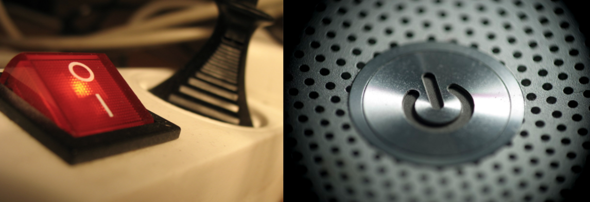
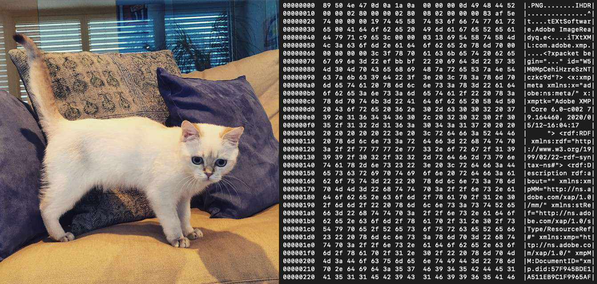

<!-- paginate: true -->

[<](../README.md)


# Data Basics

How computers store data, and encode files and text

<sup class="small"><a href="../slides/topics-data-basics.html">slides</a> | <a href="../topics/data-basics.md">markdown</a> </sup>

<!--
Presentation comments ...
-->


---


### Contents

1. [Introduction](#introduction)
1. [How do computers store data?](#how-do-computers-store-data) `5 min`
1. [Bits and Bytes](#bits-and-bytes) `5 min`
1. [Character encoding](#character-encoding) `5 min`
1. [File encoding](#file-encoding) `5 min`
1. [Discussion](#discussion) `5 min`
1. [Keep practicing](#keep-practicing)
1. [References](#references)


---


### Introduction

Review the following sections and perform the activities on your own or with your group.

<details>
<summary>Learning Objectives</summary>

Students who complete the following will be able to:

- Recall how computers store and use binary data
- Organize data storage amounts by their respective sizes
- Use conversion tools to demonstrate binary, and ASCII and Unicode character encoding standards
- Define character encoding and file encoding
- Use the command line to examine text- and binary-encoded files

</details>

<details>
<summary>Preparation</summary>

Complete the following to prepare for this module

- [Command Line Crash Course](command-line-crash-course.md)
- Review the slides in this [Binary Data](https://docs.google.com/presentation/d/1hV4hEiAT_795nXuNIg49VqsZr69UnJ4i_5-dv_2th1U/edit#slide=id.g3ee23d7716_0_1) presentation

</details>

---


## How do computers store data?

- Most modern computers use SSDs (solid state drives) to store *data* (text, photos, videos, etc.) by representing the content of these files using electrons.
- Imagine millions of tiny switches inside your computer, and each can each be either `on` or `off`.

<a href="../assets/img/data-basics/data-switch-wall.png"></a> <a href="../assets/img/data-basics/microchip.jpg"></a>


---


Since a switch can be in only one of two states, this single binary value, the smallest unit of data a computer can store, is aptly named one **bit**.

<a href="../assets/img/data-basics/data-switch-symbols.png"></a>

<div class="caption small">

1. The on/off binary symbols are ubiquitous on mechanical interfaces
1. The ⏻ "power on" symbol on computers

</div>


---


Power | ON | OFF
:--- | :---: | :----:
Boolean | true | false
Binary | 1 | 0
Symbol | ⏽ | ⭘

The values of a switch with their binary, boolean, and symbolic equivalent.


---


## Bits and Bytes

The switches that store binary data are grouped in bundles of **8 bits**, or **1 byte**. While a switch can be in only one of 2 states, each switch in a row of n switches can be in one of 2<sup>n</sup> (2\*2\*2\*2\*[...]) states! This table describes common file size units and corresponding examples.


Unit | Symbol | Value | Example size
:--- | :---: | :---- | :----
1 bit | bit | `0` or `1` | a boolean value (e.g. `true`)
1 byte | byte | 8 bits | a single text character
1 kilobyte | KB | 1024 bytes | a multipage text document
1 megabyte | MB | 1024 kilobytes | a medium-resolution photo file
1 gigabyte | GB | 1024 megabytes | a feature length movie
1 terabyte | TB | 1024 gigabytes | a hard drive
1 petabyte | PB | 1024 terabytes |


---

👉 **Try it out**

1. Let's confirm the above information about a byte. Enter a single alphetical character `a` into this [BitCounter](https://lingojam.com/BitCounter) and [ByteCounter](https://lingojam.com/ByteCounter). You should see it is equal to 8 bits and 1 byte, respectively.
1. The binary representation of the Latin character `a` is `01000001`. But if you plug that sequence into a [Binary to Decimal Converter](https://www.binaryhexconverter.com/binary-to-decimal-converter) it will return not a letter, but the number `65`. Why?


---


## Character Encoding

Character encoding is the process by which computers store and represent text by assigning numbers (and their binary equivalents) to alphanumeric characters.

The ASCII (American Standard Code for Information Interchange) (~1963) is based on the English alphabet and encodes 128 characters which each use 7-bits.

<a href="../assets/img/data-basics/ascii.png"></a>

---

### Unicode

As computing expanded, more character sets were added to accommodate other languages, characters, and symbols.

The Unicode standard (1988) uses one to four 8-bit bytes to represent up to 1,112,064 possible letters, numbers, and emoji and ensure everyone sees the same character across all devices and languages.

UTF-8 is currently the most popular version of this standard and now includes 143,859 characters, including non-visible characters such as the carriage return.


---


👉 **Try it out**

1. **Count the bits** using [this tool](https://lingojam.com/BitCounter) for each of the following lines of text. ***Try to guess the outcomes first!*** Some of these will not produce what you may think. Do you know why?

```
a
abc
0123456789
01234 56789
ü
ñ
😂
```

---

👉 **Try it out**

2. **Convert binary data to text** using the binary representations (below) of the above examples with the [Binary to ASCII](https://www.convertbinary.com/to-text/) and [Binary <> UTF-8](http://www.unit-conversion.info/texttools/convert-text-to-binary/) converters. One of these tools will only be able to convert some sequences, do you know why?

```
01100001
01100001 01100010 01100011
00110000 00110001 00110010 00110011 00110100 00110101 00110110 00110111 00111000 00111001
00110000 00110001 00110010 00110011 00110100 00100000 00110101 00110110 00110111 00111000 00111001
11000011 10111100
11000011 10110001
11110000 10011111 10011000 10000010
```

---

👉 **Try it out**

3. **Compare ASCII to Unicode**  The first 128 characters of UTF8 are based on the ASCII standard. If you compare the below table to the ASCII chart above you will find a slight discrepancy. Yet you can still [convert](http://www.unit-conversion.info/texttools/convert-text-to-binary/) each to the appropriate text character. Do you know what the discrepancy is?

ASCII | b | i | t | s
--- | --- | --- | --- | ---
Binary | `01100010` | `01101001` | `01110100` | `01110011`
Decimal | `98` | `105` | `116` | `115`


---

👉 **Try it out**

<details>
<summary>Answers</summary>

1. **Count the bits**
    1. These numbers `01234 56789` are each 8 bits, but so is the space character between them since whitespace (spaces, tabs, returns) also require storage. So the total is `88`.
    1. Foreign characters like `ü` and `ñ` were not included in the ASCII standard. They are covered by Unicode, and each require `16` bits.
    1. Most emoji require `32` bits or `4` bytes `😂`
2. **Convert binary data to text** Since ASCII can only represent 7 bits, anything over 1 byte will fail if converted to ASCII. Instead you have to convert to UTF-8 text.
3. **Compare ASCII to Unicode** ASCII only required 7 bits for each character `2 * 2 * 2 * 2 * 2 * 2 * 2`, but Unicode just adds a zero at the beginning of the binary sequence since it is 1-4 bytes.

</details>


---


## File encoding

**File encoding** describes how files are viewed and saved by software.

While all data on computers is stored on the hard disk as binary data, some file types use binary file encoding, and others use text file encoding.

A typical example is a `.txt` file. If you open a text file in a plain text editor (e.g. [Notepad](https://en.wikipedia.org/wiki/Microsoft_Notepad) on Windows, or [TextEdit](https://en.wikipedia.org/wiki/TextEdit) on Mac) you can see and edit the text contents.


---

Other files, like most image files, cannot be edited in a plain text editor.



---

The previous photo of a [cat](../assets/img/data-basics/cat.png) is displayed by an application that can read and render the image data as pixels on a screen.

On the right is the binary representation of the same file's data using hexdump. Columns 1-3 show the hexidecimal data of the file and the last column displays any ASCII data that can be read, including (like most file types) the [file's extension on the first line](http://www.libpng.org/pub/png/spec/1.2/PNG-Rationale.html#R.PNG-file-signature).


---


👉 **Try it out**

View contents of a binary file on the command line with [hexdump](https://en.wikipedia.org/wiki/Hex_dump).

1. Save the [cat.png](../assets/img/data-basics/cat.png) image file and [cat.txt](../assets/img/data-basics/cat.txt) plain text file to your computer.
1. Use the command line to navigate to the folder where you saved the files `cd /path/to/your/files/`
1. Run each of these commands to view the contents. **What do you notice?**

```bash
hexdump -C cat.png
hexdump -C cat.txt
```

To summarize...

---


### Binary-encoded files

- Stored as bits (binary 1s and 0s) and may include multiple types of data in the same file (e.g video and audio), as well as ASCII data representing meta information about the file type.
- More efficient to store and access but sometimes proprietary software is required and files can easily become corrupted.
- Examples `.jpg` `.png` `.pdf` `.mp4`.


### Text-encoded files

- Also stored as bits, but represented by actual text characters.
- You can open text files in many types of editors.
- Examples `.txt` `.html` `.css`.

---

### File vs. character encoding

File encoding [is not the same as](https://kunststube.net/encoding/) character encoding. If you can open ***and read*** a file in a plain text editor (e.g. [Notepad](https://en.wikipedia.org/wiki/Microsoft_Notepad) on Windows, or [TextEdit](https://en.wikipedia.org/wiki/TextEdit) on Mac) it is a text file. However, if the content of the file appears as mostly garbled text, it is a binary file.


<sup class="caption">A `.png` file opened in TextEdit</sup>


---

👉 **Try it out** Compare other files on your computer

1. Find other examples of each type of encoding on your own computer.
1. Open them in a plain text editor or use hexdump to see what type of file encoding they use?
1. What clues can you see in the binary formats to tell you about the filetype or other metadata?

---

## Keep practicing

- [Learn Computing: Data Types](data-types.md)
- [Learn Computing: Data Cleaning](data-cleaning.md)

---

## References

- [When bandwidth and storage size matters: Bits vs. bytes](https://www.redhat.com/sysadmin/bits-vs-bytes)
- [What Every Programmer Absolutely, Positively Needs To Know About Encodings And Character Sets To Work With Text](https://kunststube.net/encoding/)
- [Zoom into a computer chip: Watch this video to fully appreciate just how magical modern microchips are](https://www.extremetech.com/extreme/191996-zoom-into-a-computer-chip-watch-this-video-to-fully-appreciate-just-how-magical-modern-microchips-are)
