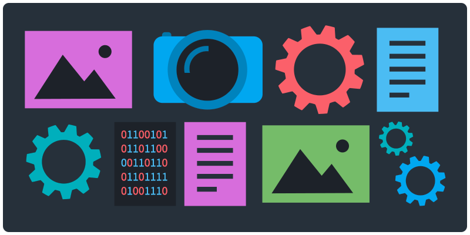
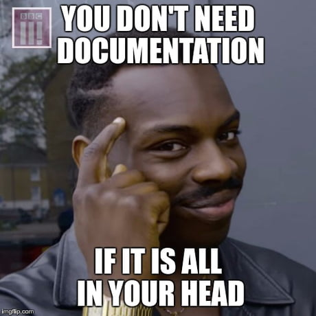
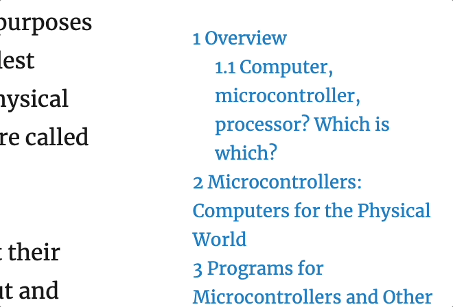

<!-- paginate: true -->

<a class="back-icon" href="../index.html"></a>



# Documentation

Tips for documenting your creative and technical work

<span class="slides-small"><a href="../slides/documentation.html">slides</a> | <a href="../www/documentation.html">HTML</a></span>

<!--
Presentation comments ...
-->


---

### Contents

1. [Introduction](#introduction)
1. [About](#about)
1. [Capture everything](##capture-everything)
1. [Start a Google Doc](#iterate-iterate-iterate)
1. [Screenshots and videos](#screenshots-and-videos)
1. [Source code](#source-code)
1. [Collect it all](#collect-it-all)
1. [Edit a video](#edit-a-video)
1. [White paper](#white-paper)


---

## Introduction

Review the following sections and perform the activities on your own or with your group.

Perform the task(s) when you see this 👉  emoji

<details>
<summary>Learning Objectives</summary>

Students who complete the following will be able to:

- Explain why documentation is important
- List methods for documenting one's work
- Use different methods to show their creative process

</details>


---

## About

<div class="twocolumn">
<div class="col">

- You completed your project and turned it in. The last thing you want to do right now is think about it.
- Six months later, you are in a job interview and someone asks to see examples of your work.
- The problem is, you've slept since then, nothing is live anymore, and you didn't document it.


</div>
<div class="col">

</div>
</div>


---

## Capture everything

If you document your process from the outset, it will help:

- Create the work, tracking progress from conception to completion.
- Archive iterations, concepts, and successes and failures that you can reference later.
- Tell the story of your project to parents, professors, peers, potential employers, grad schools, award committees, other academics, the world.

Continue reading for examples and tips...


---

## Start a Google Doc

Collect documentation in a Google Doc and paste links, images, notes, etc. as you progress.

- **Research** (articles, artworks, concepts) while developing the concept.
- **Methods** (different mediums, practices, tools, etc.) you considered and tested.
- **Progress** (insights, discoveries, interesting knowledge gained) towards your goal(s).
- **Versions** distinct working examples of successive phases of your project?


---

## Screenshots and videos

<div class="twocolumn">
<div class="col">

- Add screenshots to your project folder as progress. The filenames will be ordered by date automatically.
- Screenshot [shortcuts](..html/keyboard-shortcuts.html#screenshots) for Mac:
	- `Whole screen` <kbd>Cmd</kbd>+<kbd>Shift</kbd>+<kbd>3</kbd>
	- `Screen section` <kbd>Cmd</kbd>+<kbd>Shift</kbd>+<kbd>4</kbd><br>
- Capture video on a Mac:
	- [Quicktime](https://support.apple.com/guide/quicktime-player/record-your-screen-qtp97b08e666/mac) (free)
	- [Giphy Capture](https://giphy.com/apps/giphycapture) (free)
	- [Screenflow](http://www.telestream.net/screenflow/overview.htm) ($).

</div>
<div class="col">


<div class="caption slides-small">Made with <a target="_blank" href="https://giphy.com/apps/giphycapture">Giphy Capture</a></div>

</div>
</div>


---

## Create a video

Videos are great for incorporating the whole story. For example, in both [Immaterials: light painting WiFi](http://www.nearfield.org/2011/02/wifi-light-painting/) and [My little piece of Privacy](https://www.youtube.com/watch?v=rKhbUjVyKIc&ab_channel=NiklasRoy), the videos:

- Tell the story dramatically, with music, a story, and/or a narrator or text subtitles.
- Combine text, footage of the object, game, or working interface, and screencasts of the command line.
- Are published online for the world to see, share, or embed.


---

## Source code

Sharing source code has never been more convenient:


<div class="twocolumn">
<div class="col">

- Make it live on Github or in a [Gist](https://gist.github.com/) so that others can see and use it.
- Attribute others (name, URL, etc.) in a comment preceding any code you borrowed.
- Consider adding a [CC](http://creativecommons.org/licenses/by-nc-sa/3.0/us/) or open source license to your repository so others might do the same.

</div>
<div class="col">

```js
/**
 * Convert Fahrenheit to Celsius:
 * Credit: W3Schools Javascript Examples
 * https://www.w3schools.com/js/js_examples.asp
 */
function toCelsius(f) {
	return (5/9) * (f-32);
}
console.log(`${toCelsius(77)}`);
```

</div>
</div>


---

## Collect it all

Combine all of the above (the code, statements, screenshots/videos, images, flowcharts) into a single document, preferably that is online and you can share with others:

- Edit multiple segments, text, and other documentation into a video
- A Google Presentation or slide deck
- A white paper (see next slide) published online as a PDF or web page


---

## White paper

White papers offer a common format to document, discuss, and share research-based projects. In your document should:

- Include a statement (800–1200 words) explaining the ideas behind your project.
- Document your process with images, sketches, flowcharts, links to videos.

Suggestions for preparing such reports:

- Purdue OWL [White Paper: Purpose and Audience](https://owl.purdue.edu/owl/subject_specific_writing/professional_technical_writing/white_papers/index.html)
- [How to Write White Papers People Actually Want to Read](https://coschedule.com/blog/how-to-write-white-papers/)
- [8 Basic Tips for Writing an Amazing White Paper](https://contently.com/strategist/2012/02/10/how-to-write-a-white-paper/)


---

## White paper examples

Artistic / Cultural
- Jonathan Harris and Sep Kamvar, [We Feel Fine and Searching the Emotional Web](../assets/img/documentation/whitepaper-examples/Harris-Kamvar-We-Feel-Fine.pdf), 2005
- Julian Oliver [The Transparency Grenade](../assets/img/documentation/whitepaper-examples/Oliver-Transparency-Grenade.pdf), 2012

Commercial
- Google [The Arrival of Real-Time Bidding and What it Means for Media Buyers](../assets/img/documentation/whitepaper-examples/Google-real-time-bidding.pdf)
- ExactFlat [Accurate 3D to 2D Flattening](../assets/img/documentation/whitepaper-examples/ExactFlat_Customer_White_Paper.pdf)
- QRA [How to Eliminate Over Half of All Design Errors Before they Occur](../assets/img/documentation/whitepaper-examples/Leveraging-NLP-in-Requirements-Analysis.pdf)
