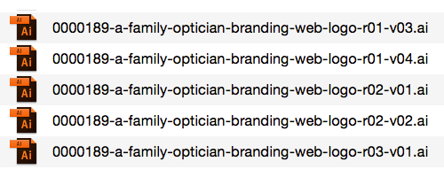
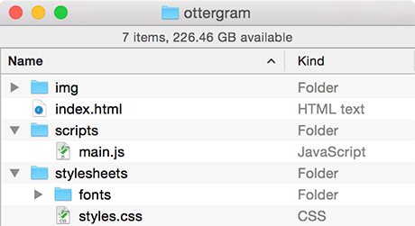
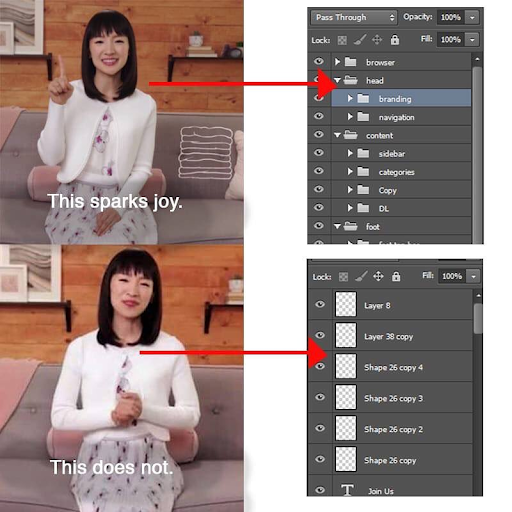

<!-- paginate: true -->

[<](../README.md)

# File organization and naming conventions

Best practices for organizing and naming your files.

<a href="../slides/files-naming-conventions.html">slides</a> | <a href="../topics/files-naming-conventions.md">markdown</a> 

<!--
Presentation comments ...
-->

---

### Contents

1. [Introduction](#introduction)
1. [File naming conventions](#file-naming-conventions) `5 min`
1. [Discussion](#discussion) `5 min`
1. [Keep practicing](#keep-practicing)
1. [References](#references)

---

## Introduction

Review the following sections and perform the activities on your own or with your group.

Perform the task(s) when you see this 👉  emoji

Learning Objectives

Students who complete the following will be able to:

- Describe ...
- List ...
- Explain ...
-Demonstrate best practices for naming and organizing files and folders

Preparation

Complete the following to prepare for this module

- [Command Line Crash Course](command-line-crash-course.md)

---

## File naming conventions

👉 Do you ever have trouble finding or identifying files?

1. Share your current file naming convention in your group. What currently is working for you and what is not?
1. Can you find examples on your computer of good and bad uses of file naming conventions? Screenshot them and share. It's OK, we've all been there. 🤗

---

### Best Naming Practices

Operating system manufacturers are constantly changing how they organize their files, often obscuring the users' access to files with abstractions.

If you name your files with a bit of forethought you'll find you can identify them much faster.

---

### Best Naming Practices

Tips for how to choose the text you use to name your files, folders, even code...

- **Use descriptive names**: Perhaps the most important tip. Do yourself a favor and name files, folders, code, etc., as if a complete stranger (you!) will see it in the future. Don't use `untitled`, `stuff`, `new` in your names.
- **Avoid abbreviations**: How will "future you" remember that `design-1-rtrbith.png` is the design variation where you *"removed the red box in the header"*? This would work better `design-1-red-header-removed.png`
- **Append version numbers and/or dates**: When iterating, don't append the relative term, `new`, to your files. Use an actual version number like `design-v6.psd` or the date `paper-draft2-20210501.psd` so that you know exactly what the file is *AND* your OS will organize the files appropriately.

---

### Everything is case-sensitive on the internet

When you name ***any*** file or folder that could potentially be viewed in a web browser (e.g. web pages, PDFs, images, javascript, css, folders, and many others) it is essential to:

- Do not use spaces in your filenames: Replace with hyphens, underscores, or camelCase.
- Use a [naming convention](https://en.wikipedia.org/wiki/Naming_convention_(programming)), so you don't have to think when you type your code. Look for an established convention
- **Best practice**: Only use lowercase names with no spaces.

---

### Popular naming conventions

Common naming for files, folders, code, etc. that remove spaces between words.

Convention | Where | Examples | Notes
--- | --- | --- | ---
PascalCase | C# | `UserAccount` | Words are delimited by capital letters
camelCase | Javascript, CSS | `userAccount` | Words are delimited by capital letters, except the initial word
snake_case | [Python](https://medium.com/@dasagrivamanu/python-naming-conventions-the-10-points-you-should-know-149a9aa9f8c7), [R](https://style.tidyverse.org/) | `user_account` | Words are delimited by an underscore
kebab-case |  | `user-account` | Words are delimited by hyphens
SCREAMING_CASE |  | `USER_ACCOUNT` | Words are all caps, and or delimited by an underscore

---

## Discussion

👉 How would you name and organize each of these files:

1. Draft 3 of your Microsoft Word document containing your essay "World War II's Influence on Modern Art in the 1950's"
1. A PDF of the above document that you plan to share on a website.
1. A document containing research you collected while writing the document.

---

  

It is always a good practice to iterate, whether you are working on a concept, a design, or a paper.
But, name your files with forethought and organization in mind.
    Left: 😢 no convention in use, names are not descriptive
    Right: 🙌 names follow similar convention, include descriptions, iterations, and versions

---

 

Be deliberate in how you name and structure your folder and project layers and hierarchies. Being organized only takes a little time now, but will save you lots later!

---

## Keep practicing

1. Check out this style guide and share your thoughts [Google HTML/CSS Style Guide](https://google.github.io/styleguide/htmlcssguide.html)

---

## References

- [Top 10 Unity best practices: Naming Conventions](https://www.reddit.com/r/gamedev/comments/3a1k33/top_10_unity_best_practices_naming_conventions/)
- [Devopedia: Naming Conventions](https://devopedia.org/naming-conventions)
