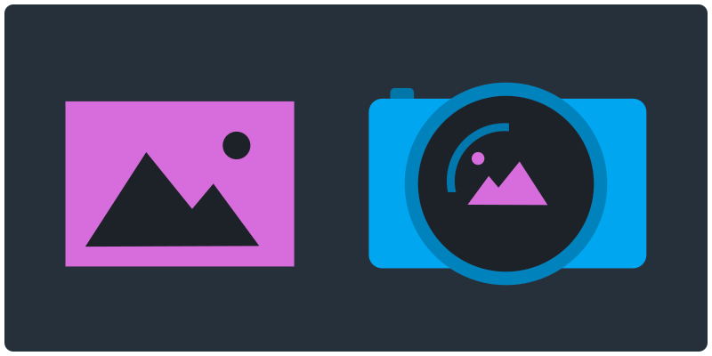

<!-- paginate: true -->

# Images: Formats, Resolutions

Learn about digital images formats and best practices

<a href="../slides/images-resolutions.html">slides</a> | <a href="../topics/images-resolutions.md">md</a>

<!--
Presentation comments ...
-->

---

### Contents

1. [Introduction](#introduction)
1. [Image formats](#image-formats) `5 min`
1. [Discussion](#discussion) `5 min`
1. [Keep practicing](#keep-practicing)
1. [References](#references)

---

## Introduction

Review the following sections and perform the activities on your own or with your group.

Perform the task(s) when you see this 👉  emoji

Learning Objectives

Students who complete the following will be able to:

- Describe types of digital images that computers can display and process
- List some common image types and their characteristics
- Explain ...
- Demonstrate ...

Preparation

Complete the following to prepare for this module

- [Command Line Crash Course](command-line-crash-course.md)

---

## Image formats

Humans are intensely visual, and it follows that our most important tool is more than capable at representing the world through pictures.

---

## Raster vs. Vector

All images you see on a computer are both the data that makes up the file, as well as the rendered data rendered using a pixel display. So by the time you see the image it has been translated to pixel space.

Still, these images are stored and handled very differently.

---

Type | Description | File size | Example formats
--- | --- |--- |---
Raster | Also called "bitmap" - image data stored as pixels | Large | JPG, PNG, GIF
Hybrid | A binary file that contains both raster and vector data | Medium | EPS, PDF
Vector | Image rendered from list of points describing polygons | Relatively small | SVG
Character sets | 16 bit characters reference fonts or emoji stored on device  | Tiny | 👍🦄🍤

---

## About videos

All videos are just a series of raster images, played in succession with an embedded sound file.

FPS | Frame Per Second
Codec |

---

### Common Image Formats

Extension | Name | Release | Compression | Description
--- | --- | --- | --- | ---
[JPG](https://en.wikipedia.org/wiki/JPEG) | Joint Photographic Experts Group | 1992 | lossy | Good for photography and images with lots of colors or gradients
[PNG](https://en.wikipedia.org/wiki/PNG) | Portable Network Graphics | 1996 | lossless | High-quality (24-bit RGB or 32-bit RGBA colors) with a true alpha channel
[GIF](https://en.wikipedia.org/wiki/GIF) | Graphic Image Format | 1987 | lossy | (8 bits per pixel) up to 256 different colors
[SVG](https://en.wikipedia.org/wiki/SVG) | Scalable Vector Graphics | 2001 | lossless | A vector graphics format stored in XML text files. Small file sizes so great for the web.
[EPS](https://en.wikipedia.org/wiki/Encapsulated_PostScript) | Encapsulated PostScript | 1987 | lossless | Text and bitmaps in a single file. 
[PDF](https://en.wikipedia.org/wiki/PDF) | Portable Document Format | 1993 | lossless* | Text and bitmaps in a single file. Based originally on PostScript, but now a widely used standard. 
[PSD](https://en.wikipedia.org/wiki/Adobe_Photoshop#File_format) | Photoshop Document | 1990 | lossless | Photoshop's default format. Very large, so images must be exported at lower resolutions for the web.

<small>
*Can save as lossy or lossless depending on settings
</small>

---

## Image Resolution

Screen resolution vs. screen resolution
Pay attention to the pixel dimensions

<!-- 

---

## Keep practicing

---

## References -->
