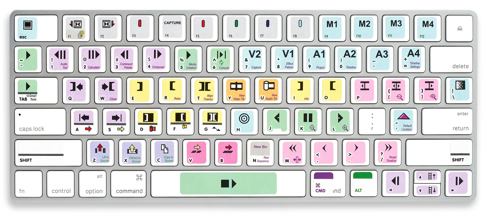
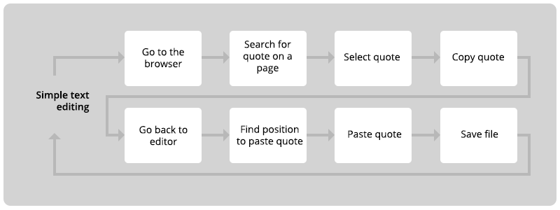
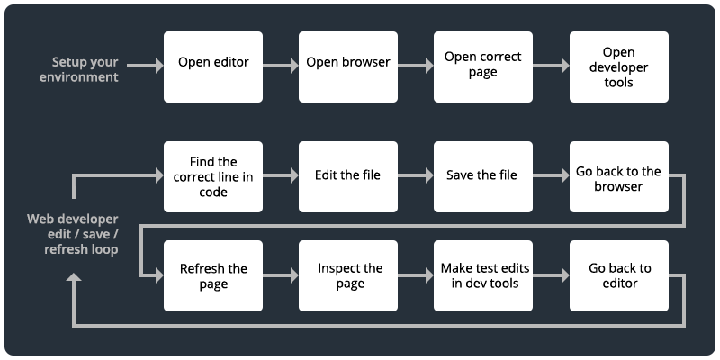

<!-- paginate: true -->

# Keyboard shortcuts & Workflows

Speed up your computing with keyboard shortcuts!

<a href="../slides/keyboard-shortcuts.html">slides</a> | <a href="../www/keyboard-shortcuts.html">HTML</a> | <a href="../topics/keyboard-shortcuts.md">md</a>

<!--
Presentation comments ...
-->

---

### Contents

1. [Introduction](#introduction) `5-10 min`
1. [Create an efficiency test](#create-an-efficiency-test) `10 min`
1. [Discussion](#discussion) `5 min`
1. [Keyboard commands](#keyboard-commands)
1. [Workflows](#workflows)
1. [Keep practicing](#keep-practicing)
1. [Assessment](#assessment)
1. [References](#references)

---

## Introduction

Review the following sections and perform the activities on your own or with your group.

Perform the task(s) when you see this 👉  emoji

Learning Objectives

Students who complete the following will be able to:

- Demonstrate basic computer keyboard commands like copy, paste, save
- Perform more advanced commands like switching programs and finding text on a web page or text doc
- Explain how keyboard commands can increase computing efficiency
- Combine multiple keyboard commands to establish faster computing workflows

Preparation

Complete the following to prepare for this module

- [Command Line Crash Course](command-line-crash-course.md)

---

## Discussion

👉 In your group, discuss the following.

1. What tips do you know for making your computer use efficient?
1. Do you currently use your non-mouse hand to enter commands on your computer keyboard?

---

Now, practice all the [keyboard commands](#keyboard-commands) below, including the series of commands in the [text editing workflow](#workflows).

1. Which of the basic 🍏  or advanced 🔥 shortcuts are new to you?
1. Did you find it awkward to use the shortcuts at first?

---

 
Many industries use templates, like this Avid Media Composer helper, to help recall keyboard shortcuts.

---

## Scientific management

In the 1910's, Frederick Taylor recorded the [workflows of laborers](https://www.shutterstock.com/video/clip-19628218-frederick-taylors-pig-iron-carrying-experiment-tests) and used the data to increase productivity.

Through his [scientific management](https://en.wikipedia.org/wiki/Scientific_management) analysis, he learned that efficiency actually *increased* if workers took more breaks because it gave them time to recover from the work.

Like Taylor, we want to know how we might improve our efficiency at the keyboard. And perhaps more importantly, what could we do with the saved time?!

---

## 👉 Create an efficiency test

Use the following instructions to measure the efficiency of using (and not using) keyboard shortcuts over the equivalent actions, or series of actions.

- Consider multiple commands and contexts (like the [text editing workflow](#workflows)).
- More than one person in your group should take the test(s).
- Perform each with and without keystrokes.
- Move at the speed you would normally move.

---

## 👉 Create an efficiency test

For each action or series, record the number of clicks and the total time:

1. to find the thing you need to click with the mouse
1. to move your mouse hand from the keyboard to type and back
1. to move your mouse on the screen. (e.g. from your file, ***aaaaaall*** the way up to the top left, to choose File > Save, then back down to the space where you were working on the screen)

Here are some to get you started. Try to create 3 more, (use the web dev workflow if you are comfortable).

---
<table>
<tr>
<td>Action</td>
<td colspan="2">🚫 Without</td>
<td colspan="2">🔥 With ⌨️</td>
</tr>

<tr>
<td></td>
<td>Time</td>
<td>Clicks</td>
<td>Time</td>
<td>Clicks</td>
</tr>

<tr>
<td>Create a new text file, type "hello world", and save it.</td>
<td></td>
<td></td>
<td></td>
<td></td>
</tr>

<tr>
<td>Copy/paste the first 10 words of this page into a text file, each on a new line, one at a time, saving each time</td>
<td></td>
<td></td>
<td></td>
<td></td>
</tr>

<tr>
<td>Select/copy/paste <i>all</i> text on a <a href="https://www.poetryfoundation.org/poems/45477/song-of-myself-1892-version" target="_blank">long web page</a> into a new google doc</td>
<td></td>
<td></td>
<td></td>
<td></td>
</tr>

<tr>
<td><a href="#workflows">Basic text editing workflow</a></td>
<td></td>
<td></td>
<td></td>
<td></td>
</tr>
<tr>
<td>?</td>
<td></td>
<td></td>
<td></td>
<td></td>
</tr>

<tr>
<td>?</td>
<td></td>
<td></td>
<td></td>
<td></td>
</tr>

<tr>
<td>?</td>
<td></td>
<td></td>
<td></td>
<td></td>
</tr>

</table>

---

## 👉 Discussion

After you record your data, prepare to share it and your answers to the following with the class

1. Did you find it faster to use shortcuts? Which shortcuts saved the most time?
1. Estimate the time difference between each in 1 hour, 1 day, 1 week, or a whole semester of computer work.
1. Considering how often you perform these actions, what would you do with that extra time?
1. Share your results with the class.

---

## Keyboard commands

Try the following keyboard commands for your OS:

---

#### Text editing

Command | Mac | Windows | 🤔
--- | --- | --- | ---
Cut | <kbd>Cmd</kbd> + <kbd>X</kbd> | <kbd>Ctl</kbd> + <kbd>X</kbd> | 🍏
Copy | <kbd>Cmd</kbd> + <kbd>C</kbd> | <kbd>Ctl</kbd> + <kbd>C</kbd> | 🍏
Paste | <kbd>Cmd</kbd> + <kbd>V</kbd> | <kbd>Ctl</kbd> + <kbd>V</kbd> | 🍏
Undo | <kbd>Cmd</kbd> + <kbd>Z</kbd> | <kbd>Ctl</kbd> + <kbd>Z</kbd> | 🍏
Redo | <kbd>Cmd</kbd> + <kbd>Y</kbd> | <kbd>Ctl</kbd> + <kbd>Y</kbd> |
Find | <kbd>Cmd</kbd> + <kbd>F</kbd> | <kbd>Ctl</kbd> + <kbd>F</kbd> | 🔥
Select all | <kbd>Cmd</kbd> + <kbd>A</kbd> | <kbd>Ctl</kbd> + <kbd>A</kbd> | 🔥
Move cursor by letter or line | <kbd>←</kbd> <kbd>→</kbd> <kbd>↑</kbd> <kbd>↓</kbd> | <kbd>←</kbd> <kbd>→</kbd> <kbd>↑</kbd> <kbd>↓</kbd> | 🔥
Move cursor by word | <kbd>Option</kbd> + <kbd>←</kbd> or <kbd>→</kbd> | <kbd>Option</kbd> + <kbd>←</kbd> or <kbd>→</kbd> | 🔥
Select letters | <kbd>Shift</kbd> + <kbd>←</kbd> or <kbd>→</kbd> | <kbd>Shift</kbd> + <kbd>←</kbd> or <kbd>→</kbd> | 🔥
Select lines | <kbd>Shift</kbd> + <kbd>↑</kbd> or <kbd>↓</kbd> | <kbd>Shift</kbd> + <kbd>↑</kbd> or <kbd>↓</kbd> | 🔥
Select words | <kbd>Shift</kbd> + <kbd>Option</kbd> + <kbd>←</kbd> or <kbd>→</kbd> | <kbd>Shift</kbd> + <kbd>Option</kbd> + <kbd>←</kbd> or <kbd>→</kbd> | 🔥

---

#### Document and application management

Command | Mac | Windows | 🤔
--- | --- | --- | ---
Save the current file | <kbd>Cmd</kbd> + <kbd>S</kbd> | <kbd>Ctl</kbd> + <kbd>S</kbd> | 🍏
Open a document | <kbd>Cmd</kbd> + <kbd>O</kbd> | <kbd>Ctl</kbd> + <kbd>O</kbd>
Create a new document | <kbd>Cmd</kbd> + <kbd>N</kbd> | <kbd>Ctl</kbd> + <kbd>N</kbd>
Close current window | <kbd>Cmd</kbd> + <kbd>N</kbd> | <kbd>Ctl</kbd> + <kbd>N</kbd>
Quit current app | <kbd>Cmd</kbd> + <kbd>Q</kbd> | <kbd>Ctl</kbd> + <kbd>Q</kbd>
Switch programs | <kbd>Cmd</kbd> + <kbd>Tab</kbd> | <kbd>Windows</kbd> + <kbd>Tab</kbd> | 🔥

---

#### Web Browsing

Command | Mac | Windows | 🤔
--- | --- | --- | ---
Open a new window | <kbd>Cmd</kbd> + <kbd>N</kbd> | <kbd>Ctl</kbd> + <kbd>N</kbd> | 🍏
Open a new tab | <kbd>Cmd</kbd> + <kbd>Tab</kbd> | <kbd>Ctl</kbd> + <kbd>Tab</kbd> | 🍏
Reopen closed tab | <kbd>Shift</kbd> + <kbd>Cmd</kbd> + <kbd>T</kbd> | <kbd>Shift</kbd> + <kbd>Ctl</kbd> + <kbd>T</kbd>
Find on a web page | <kbd>Cmd</kbd> + <kbd>F</kbd> | <kbd>Ctl</kbd> + <kbd>F</kbd> | 🔥
Reload the page | <kbd>Cmd</kbd> + <kbd>R</kbd> | <kbd>Ctl</kbd> + <kbd>R</kbd> | 🔥
Reload page and clear cache | <kbd>Shift</kbd> + <kbd>Cmd</kbd> + <kbd>R</kbd> | <kbd>Shift</kbd> + <kbd>Ctl</kbd> + <kbd>R</kbd> | 🔥

---

#### Screenshots

Command | [Mac](https://support.apple.com/en-us/HT201361) | Windows | 🤔
--- | --- | --- | ---
Capture entire screen | <kbd>Cmd</kbd> + <kbd>Shift</kbd> + <kbd>3</kbd> | <kbd>PrtScn</kbd> | 🍏
Capture a portion of a screen | <kbd>Cmd</kbd> + <kbd>Shift</kbd> + <kbd>4</kbd> + drag ⌖ to select | ? | 🍏
Capture a window or a menu | <kbd>Cmd</kbd> + <kbd>Shift</kbd> + <kbd>4</kbd> then <kbd>Space</kbd> | <kbd>Alt</kbd> + <kbd>PrtScn</kbd> | 🍏

Add <kbd>Ctl</kbd> to Mac commands to capture the image to clipboard (to paste the file in a doc).

And please, <a href="https://www.macworld.com/article/233847/how-to-get-rid-of-the-screenshot-drop-shadow-in-macos.html">remove that dropshadow from Mac screenshots</a>!

---

#### Mouse and other tricks (* requires [Rectangle](https://rectangleapp.com/) for Mac)

Command | Mac | Windows | 🤔
--- | --- | --- | ---
Add your cursor to a document | Click once where you like | Click once where you like | 🍏
Select a word | Double click any word | Double click any word | 🔥
Select a whole line of text | Triple click anywhere | Triple click anywhere | 🔥
Current window fill screen* | <kbd>Ctl</kbd> + <kbd>Option</kbd> + <kbd>Return</kbd> | ? | 🔥
Window to left of screen* | <kbd>Ctl</kbd> + <kbd>Option</kbd> + <kbd>←</kbd> | ? | 🔥
Window to top of screen* | <kbd>Ctl</kbd> + <kbd>Option</kbd> + <kbd>↑</kbd> | ? | 🔥

---

## Workflows

### Basic text editing

👉 Level up your text editing skills.

---

Command | Mac | Windows
--- | --- | ---
Find first quote with "pig" on this [page](https://www.audible.com/blog/quotes/kurt-vonnegut) | <kbd>Cmd</kbd> + <kbd>F</kbd> + "pig" | <kbd>Ctl</kbd> + <kbd>F</kbd> + "pig"
Jump to the 2nd "pig" quote | <kbd>Cmd</kbd> + <kbd>G</kbd> | <kbd>Ctl</kbd> + <kbd>G</kbd>
Select the whole quote | Triple click on text | Triple click on text
Copy it | <kbd>Cmd</kbd> + <kbd>C</kbd> | <kbd>Ctl</kbd> + <kbd>C
Switch to your text editor | <kbd>Cmd</kbd> + <kbd>Tab</kbd> | <kbd>Ctl</kbd> + <kbd>Tab</kbd>
Find text where you want to paste a quote | <kbd>Cmd</kbd> + <kbd>F</kbd> | <kbd>Ctl</kbd> + <kbd>F</kbd>
Move cursor by word to the spot | <kbd>Option</kbd> + <kbd>←</kbd> or <kbd>→</kbd> | <kbd>Option</kbd> + <kbd>←</kbd> or <kbd>→</kbd>
Paste quote | <kbd>Cmd</kbd> + <kbd>V</kbd> | <kbd>Ctl</kbd> + <kbd>V</kbd>
Save the file | <kbd>Cmd</kbd> + <kbd>S</kbd> | <kbd>Ctl</kbd> + <kbd>S</kbd>
Repeat | ↪ | ↪

---

### Web development Edit-Save-Refresh-Loop

Building web pages requires you to do a lot of repetitive tasks. It’s a good idea to learn proficiency and develop efficient workflows early on.

---

Mastering the "Edit-Save-Refresh-Loop" can speed up your work immensely. If you can do these you'll never have to move your hands to the mouse!

Command | Mac | Windows
--- | --- | ---
Find code to edit | <kbd>Cmd</kbd> + <kbd>F</kbd> | <kbd>Ctl</kbd> + <kbd>F</kbd>
Edit the (HTML, CSS, JS, etc.) file | Using the keyboard | Using the keyboard
Save the file | <kbd>Cmd</kbd> + <kbd>S</kbd> | <kbd>Ctl</kbd> + <kbd>S</kbd>
Switch to browser | <kbd>Cmd</kbd> + <kbd>Tab</kbd> | <kbd>Ctl</kbd> + <kbd>Tab</kbd>
Refresh page | <kbd>Cmd</kbd> + <kbd>R</kbd> | <kbd>Ctl</kbd> + <kbd>R</kbd>
Inspect the page (dev tools) | <kbd>Cmd</kbd> + <kbd>Option</kbd> + <kbd>C</kbd> | <kbd>Ctl</kbd> + <kbd>Option</kbd> + <kbd>C</kbd>
Find the problem code in dev tools | <kbd>Cmd</kbd> + <kbd>F</kbd> | <kbd>Ctl</kbd> + <kbd>F</kbd>
Switch to editor | <kbd>Cmd</kbd> + <kbd>Tab</kbd> | <kbd>Ctl</kbd> + <kbd>Tab</kbd>
Repeat | ↪ | ↪

---

## Keep practicing

- [50 Keyboard Shortcuts That Work Across All Web Browsers](https://www.groovypost.com/tips/50-universal-web-browser-hotkeys/)
- [A big list of Windows and Microsoft shortcuts](../assets/img/keyboard-shortcuts/keyboard-shortcuts.gif)
- [19 Advanced Excel Shortcuts](https://www.excelcampus.com/keyboard-shortcuts/advanced-excel-shortcuts/)
- [Keyboard shortcuts in Photoshop](https://helpx.adobe.com/photoshop/using/default-keyboard-shortcuts.html) and others [in context](../assets/img/keyboard-shortcuts/keyboard-shortcuts-photoshop.png)
- [Keyboard shortcuts in After Effects](https://helpx.adobe.com/after-effects/using/keyboard-shortcuts-reference.html) and others [in context](../assets/img/keyboard-shortcuts/keyboard-shortcuts-ae.png)
- [Youtube Keyboard Shortcuts](https://support.google.com/youtube/answer/7631406?hl=en)

---

## Assessment

👉 Ready to test your skills? See if you can do the following **without touching your mouse**:

1. Create, edit, save, and email a new text document from scratch to your professor.
1. Find a Youtube video showing Stage 17 of the 2021 Tour de France and skip to the moment when Tadej Pogačar [rides away](https://youtu.be/g24EHF7-9lU?t=1614) to claim the win.

---

## References

- [Mac keyboard shortcuts](https://support.apple.com/en-us/HT201236)
- [Essential Windows Keyboard Shortcuts](https://www.lifewire.com/essential-windows-keyboard-shortcuts-2377753)
