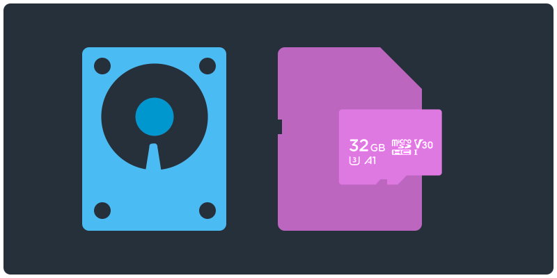

<!-- paginate: true -->

# Storage 📌

Learn how to use, format, repair data storage devices

<a href="../slides/storage.html">slides</a> | <a href="../topics/storage.md">md</a>

<!--
Presentation comments ...
-->

---

### Contents

1. [Introduction](#introduction)
1. [Discussion](#discussion) `5 min`
1. [Keep practicing](#keep-practicing)
1. [Assessment](#assessment)
1. [References](#references)

---

## Introduction

Review the following sections and perform the activities on your own or with your group.

Perform the task(s) when you see this 👉  emoji

Learning Objectives

Students who complete the following will be able to:

- Compare data storage devices and media
- List ...
- Explain ...
- Demonstrate ...

Preparation

Complete the following to prepare for this module

- [Command Line Crash Course](command-line-crash-course.md)

---

## About Storage

When speaking about USB drives, SD cards, or other computer storage:

- Storage **medium** (plural: **media**) is what actually holds the data (e.g. an SD card).
- Storage **device** is how you read or write data to the medium (e.g. an SD card reader writes data to the SD card).
- The storage media can be a fixed or permanent part of the storage device (e.g. a USB "flash" drive), or it can be removable, e.g. a CD-ROM can be taken out of a CD drive.

---

## Discussion

In your group, discuss the following.

- Q1
- Q2
- Q3

---

## Keep practicing

-

---

## References

-
